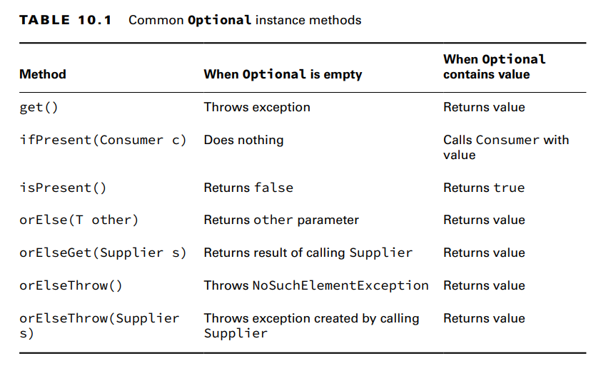

**Creating an Optional**

When creating an Optional, it is common to want to use empty() when the value is
null.You can do this with an if statement or ternary operator.
Optional o = (value == null) ? Optional.empty() : Optional.of(value); translation: If value is null, 
o is assigned the empty Optional. Otherwise, we wrap the value.
[random ]Normally, we want to check whether a value is there and/or get it out of the box. Here’s one way
Optional<Double> opt = average(90, 100);
if (opt.isPresent())
System.out.println(opt.get()); // 95.0

TABLE 10.1 Common Optional instance methods: 

-
ifPresent() is a method in Java that you can use to check if a value exists in an object, like an Optional or a Stream.
In simple terms, it allows you to perform an action (such as running a piece of code) if a value is present, 
and do nothing if the value is not there.
example: Optional<String> maybeName = Optional.of("John");
maybeName.ifPresent(name -> {
System.out.println("Name is present: " + name);
});

**Dealing with an Empty Optional**
The remaining methods allow you to specify what to do if a value isn’t present. There are
a few choices. The first two allow you to specify a return value either directly or using
a Supplier.
30: Optional<Double> opt = average();
31: System.out.println(opt.orElse(Double.NaN));->t you can return a specific value or variable
32: System.out.println(opt.orElseGet(() -> Math.random()));

- 30: Optional<Double> opt = average();
  31: System.out.println(opt.orElseThrow(
  32: () -> new IllegalStateException()));
Notice that we do not write throw new IllegalStateException(). The orElseThrow()
method takes care of actually throwing the exception when we run it

- System.out.println(opt.orElseGet(
() -> new IllegalStateException())); // DOES NOT COMPILE
The opt variable is an Optional<Double>. This means the Supplier must return a
Double. Since this Supplier returns an exception, the type does not match.