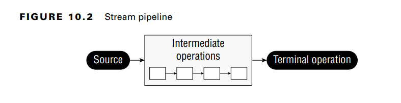
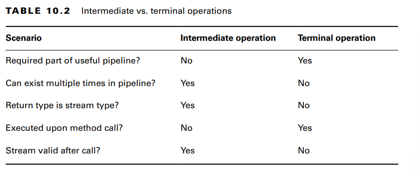
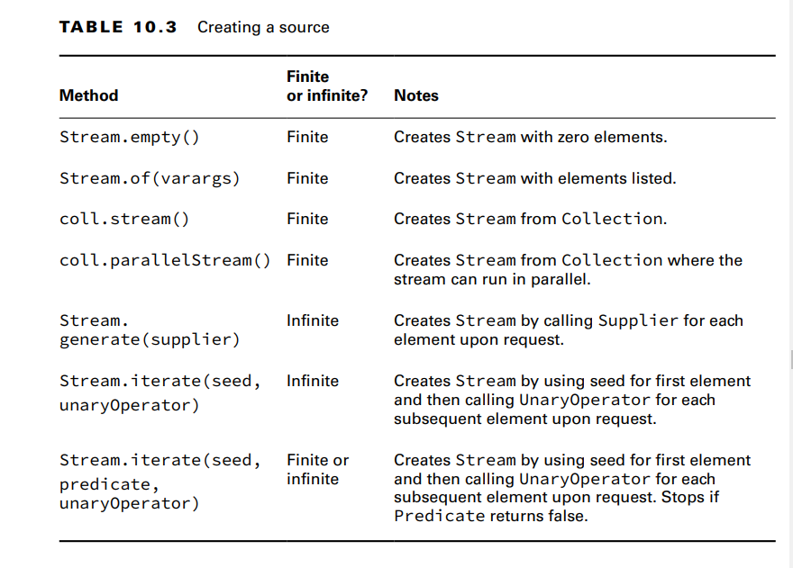
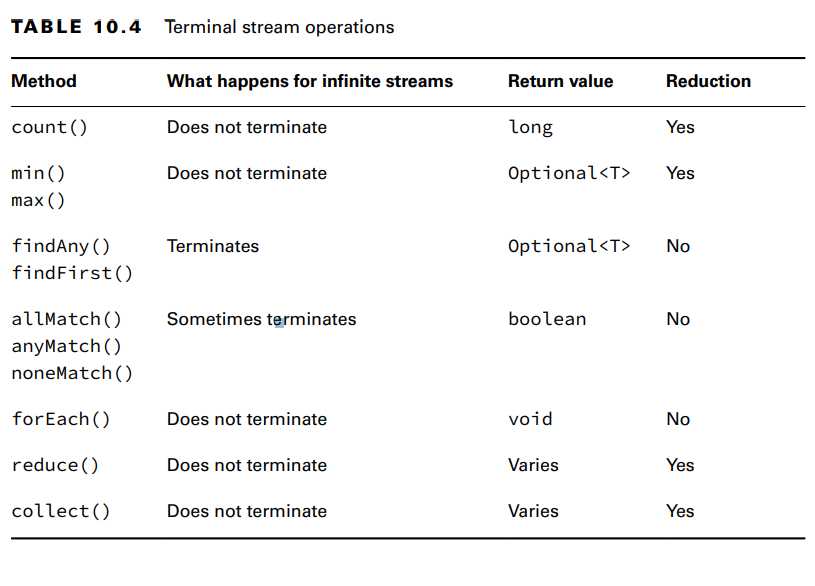
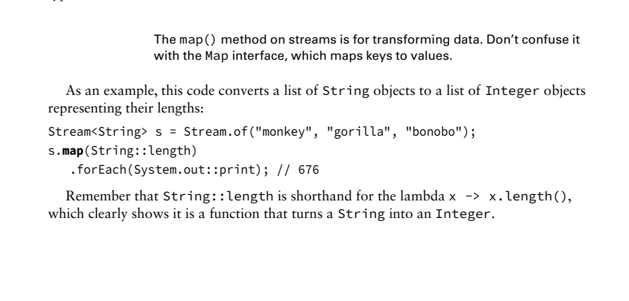
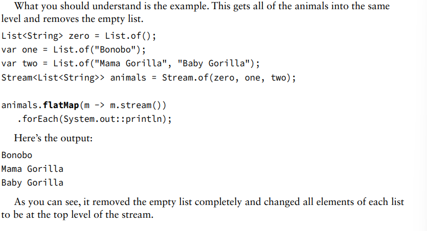
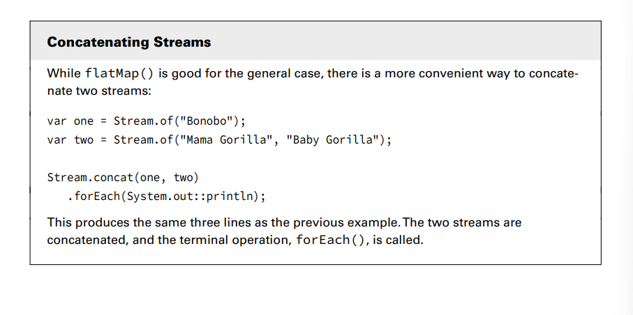
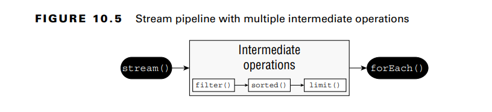

A stream in Java is a sequence of data. A stream pipeline consists of the operations that run
on a stream to produce a result.

**Understanding the Pipeline Flow:**
This is different than the lists and queues that you saw in the
previous chapter. With a list, you can access any element at any time. With a queue, you are
limited in which elements you can access, but all the elements are there. With streams,
the data isn’t generated up front—it is created when needed. This is an example of
lazy evaluation, which delays execution until necessary.

There are three parts to a stream pipeline, as shown in Figure 10.2. 
■ Source: Where the stream comes from.
■ Intermediate operations: Transforms the stream into another one. There can be as few
or as many intermediate operations as you’d like. Since streams use lazy evaluation, the
intermediate operations do not run until the terminal operation runs.
■ Terminal operation: Produces a result. Since streams can be used only once, the stream is
no longer valid after a terminal operation completes.

**Creating Stream Sources**

For simplicity, we start with finite streams. There are a few ways to create them.
11: Stream<String> empty = Stream.empty(); // count = 0
12: Stream<Integer> singleElement = Stream.of(1); // count = 1
13: Stream<Integer> fromArray = Stream.of(1, 2, 3); // count = 3
Line 11 shows how to create an empty stream. Line 12 shows how to create a stream
with a single element. Line 13 shows how to create a stream from a varargs.
Java also provides a convenient way of converting a Collection to a stream.
14: var list = List.of("a", "b", "c");
15: Stream<String> fromList = list.stream();
Line 15 shows that it is a simple method call to create a stream from a list. 

**Creating Infinite Streams**
The iterate() method takes a seed or starting value as the
first parameter. This is the first element that will be part of the stream. The other parameter
is a lambda expression that is passed the previous value and generates the next value

**Using Common Terminal Operations **
You can perform a terminal operation without any intermediate operations but not the other
way around.
-Reductions are a special type of terminal operation where all the contents of the stream are combined into a single
primitive or Object. 

TABLE 10.4 Terminal stream operations  

**Counting**
The count() method determines the number of elements in a finite stream. For an infinite
stream, it never terminates
The count() method is a reduction because it looks at each element in the stream and returns a single value. 
The method signature is as follows:

public long count()
This example shows calling count() on a finite stream:
Stream<String> s = Stream.of("monkey", "gorilla", "bonobo");
System.out.println(s.count()); // 3

**Finding the Minimum and Maximum**
The min() and max() methods allow you to pass a custom comparator and find the smallest or largest value 
in a finite stream according to that sort order
Both methods are reductions because they  return a single value after looking at the entire stream. 
The method signatures are as follows:
public Optional<T> min(Comparator<? super T> comparator)
public Optional<T> max(Comparator<? super T> comparator)

**Finding a Value**
The findAny() and findFirst() methods return an element of the stream unless the
stream is empty. If the stream is empty, they return an empty Optional.
the findAny() method can return any element of the stream.
These methods are terminal operations but not reductions.****
The method signatures are as follows:
public Optional<T> findAny()
public Optional<T> findFirst()
This example finds an animal:
Stream<String> s = Stream.of("monkey", "gorilla", "bonobo");
Stream<String> infinite = Stream.generate(() -> "chimp");
s.findAny().ifPresent(System.out::println); // monkey (usually)
infinite.findAny().ifPresent(System.out::println); // chimp

**Matching**
The allMatch(), anyMatch(), and noneMatch() methods search a stream and return information
about how the stream pertains to the predicate. These may or may not terminate for infinite
streams
The method signatures are as follows:
public boolean anyMatch(Predicate <? super T> predicate)
public boolean allMatch(Predicate <? super T> predicate)
public boolean noneMatch(Predicate <? super T> predicate)
Remember that allMatch(), anyMatch(), and noneMatch() return a boolean.
By contrast, the find methods return an Optional because they return an element of the stream.

**Iterating**
calling forEach() on an infinite stream does not terminate. Since there is no return value, it is not a reduction
Remember that you can call forEach() directly on a Collection or on a Stream. Don’t get confused on the exam when
you see both approaches.
While forEach() sounds like a loop, it is really a terminal operator for streams. Streams
cannot be used as the source in a for-each loop because they don’t implement the Iterable
interface

**Reducing**
The reduce() method combines a stream into a single object. It is a reduction, which means it processes all elements. 
**The three method signatures are these:**

- public T reduce(T identity, BinaryOperator<T> accumulator)
- public Optional<T> reduce(BinaryOperator<T> accumulator)
- public <U> U reduce(U identity,
   BiFunction<U,? super T,U> accumulator,
   BinaryOperator<U> combiner)

- The identity is the initial value of the reduction, in this case an empty String. 
- The accumulator combines the current result with the current value in the stream
  it. When you don’t specify an identity, an Optional is returned because there might not be any data. 
- There are three choices for what is in the Optional:
  ■ If the stream is empty, an empty Optional is returned.
  ■ If the stream has one element, it is returned.
  ■ If the stream has multiple elements, the accumulator is applied to combine them.

The following illustrates each of these scenarios:
BinaryOperator<Integer> op = (a, b) -> a * b;
Stream<Integer> empty = Stream.empty();
Stream<Integer> oneElement = Stream.of(3);
Stream<Integer> threeElements = Stream.of(3, 5, 6);
empty.reduce(op).ifPresent(System.out::println); // no output
oneElement.reduce(op).ifPresent(System.out::println); // 3
threeElements.reduce(op).ifPresent(System.out::println); // 90

**Collecting**
The collect() method is a special type of reduction called a mutable reduction. It is more efficient than a regular 
reduction because we use the same mutable object while accumulating.
Common mutable objects include StringBuilder and ArrayList. This is a really useful method,
because it lets us get data out of streams and into another form. The method signatures are
as follows:
public <R> R collect(Supplier<R> supplier,
BiConsumer<R, ? super T> accumulator,
BiConsumer<R, R> combiner)
public <R,A> R collect(Collector<? super T, A,R> collector)

**Using Common Intermediate Operations**
Unlike a terminal operation, an intermediate operation produces a stream as its result. An
intermediate operation can also deal with an infinite stream simply by returning another
infinite stream. 
    **Filtering**
The filter() method returns a Stream with elements that match a given expression. Here is the
method signature:
public Stream<T> filter(Predicate<? super T> predicate)

    **Removing Duplicates**
The distinct() method returns a stream with duplicate values removed. The duplicates do not
need to be adjacent to be removed. As you might imagine, Java calls equals() to determine
whether the objects are equivalent. The method signature is as follows:
public Stream<T> distinct()
Here’s an example:
Stream<String> s = Stream.of("duck", "duck", "duck", "goose");
s.distinct()
.forEach(System.out::print); // duckgoose

    **Restricting by Position**
The limit() and skip() methods can make a Stream smaller, or limit() could make a
finite stream out of an infinite stream. The method signatures are shown here:
public Stream<T> limit(long maxSize)
public Stream<T> skip(long n)

Understand this example:
The skip()
operation returns an infinite stream starting with the numbers counting from 6, since it skips
the first five elements. The limit() call takes the first two of those. Now we have a finite
stream with two elements, which we can then print with the forEach() method:
Stream<Integer> s = Stream.iterate(1, n -> n + 1);
s.skip(5)
.limit(2)
.forEach(System.out::print); // 67

    **Mapping**
the map() method creates a one-to-one mapping from the elements in the stream to the elements of the next step in the stream. The method signature is as follows:
public <R> Stream<R> map(Function<? super T, ? extends R> mapper)
**Important:!!** The map() method on streams is for transforming data. Don’t confuse it
with the Map interface, which maps keys to values.

review example 

    **Using flatMap**
The flatMap() method takes each element in the stream and makes any elements it contains
top-level elements in a single stream.This is helpful when you want to remove empty elements from a stream or 
combine a stream of lists. [UNDERSTAND THIS]

    **Sorting**
The sorted() method returns a stream with the elements sorted. Just like sorting arrays, Java
uses natural ordering unless we specify a comparator. The method signatures are these:
public Stream<T> sorted()
public Stream<T> sorted(Comparator<? super T> comparator)

    **Taking a Peek**
The peek() method is our final intermediate operation. It is useful for debugging because it
allows us to perform a stream operation without changing the stream. The method signature
is as follows:
public Stream<T> peek(Consumer<? super T> action)

**Putting Together the Pipeline**

