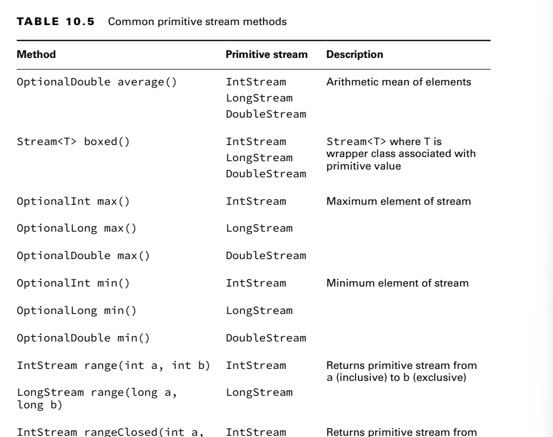
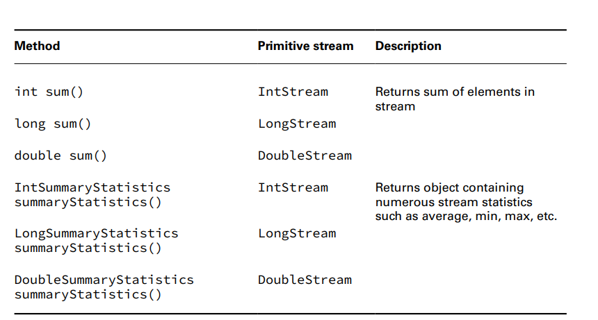
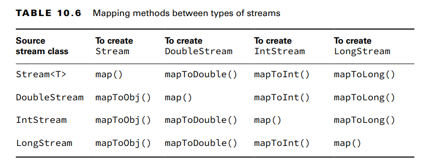
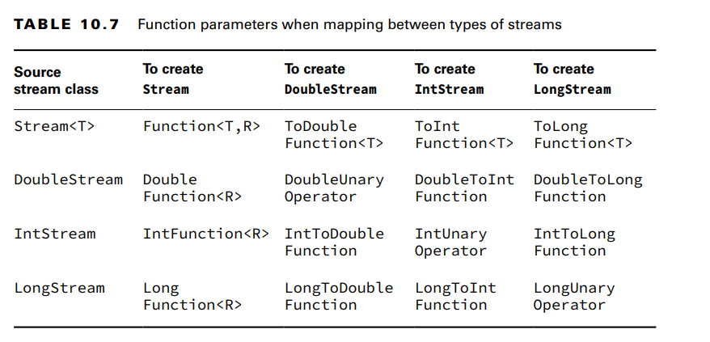
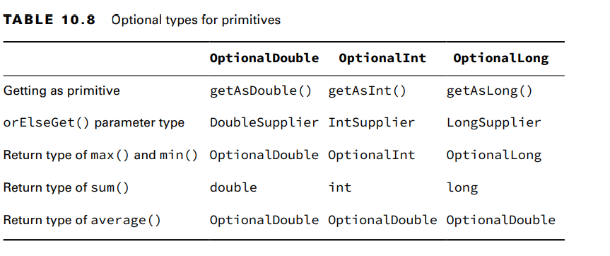

**Creating Primitive Streams**
Here are the three types of primitive streams:
■ IntStream: Used for the primitive types int, short, byte, and char
■ LongStream: Used for the primitive type long
■ DoubleStream: Used for the primitive types double and float

IMPORTANT!! When you see the word stream on the exam, pay attention to the case.
With a capital S or in code, Stream is the name of a class that contains an
Object type. With a lowercase s, a stream is a concept that might be a
Stream, DoubleStream, IntStream, or LongStream
 

**Mapping Streams** 
**Using Optional with Primitive Streams**
OptionalDouble: The difference is that OptionalDouble is for a primitive and Optional<Double>
is for the Double wrapper class.
optional.ifPresent(System.out::println); // 5.5
System.out.println(optional.getAsDouble()); // 5.5
|System.out.println(optional.orElseGet(() -> Double.NaN)); // 5.5
-->we called getAsDouble() rather than get(). This makes it clear that we are working with a primitive.
Also, orElseGet() takes a DoubleSupplier instead of a Supplier. 

As you should remember from the terminal operations section,
a number of stream methods return an optional such as min() or findAny().

- The sum() method does not return an optional. If you try to add up an empty stream, you simply get zero. 
- The average() method always returns an OptionalDouble since an average can potentially have fractional data for any type.

Summarizing Statistics:
private static int max(IntStream ints) {
OptionalInt optional = ints.max();
return optional.orElseThrow(RuntimeException::new);
}
Translation:We got an OptionalInt because we have an IntStream. If the optional contains a value, we return it  
Otherwise, we throw a new RuntimeException

Here we asked Java to perform many calculations about the stream. Summary statistics
include the following:
■ getCount(): Returns a long representing the number of values.
■ getAverage(): Returns a double representing the average. If the stream is empty, returns 0.
■ getSum(): Returns the sum as a double for DoubleSummaryStream and long for
IntSummaryStream and LongSummaryStream.
■ getMin(): Returns the smallest number (minimum) as a double, int, or long, depending on
the type of the stream. If the stream is empty, returns the largest numeric value based
on the type.
■ getMax(): Returns the largest number (maximum) as a double, int, or long depending on the type of the stream. 
If the stream is empty, returns the smallest numeric value
based on the type.