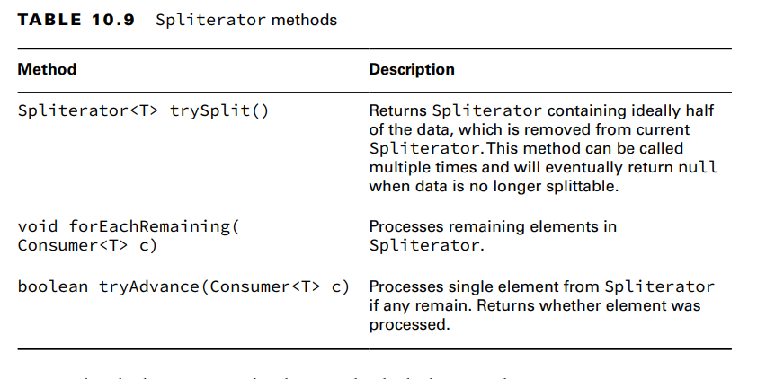
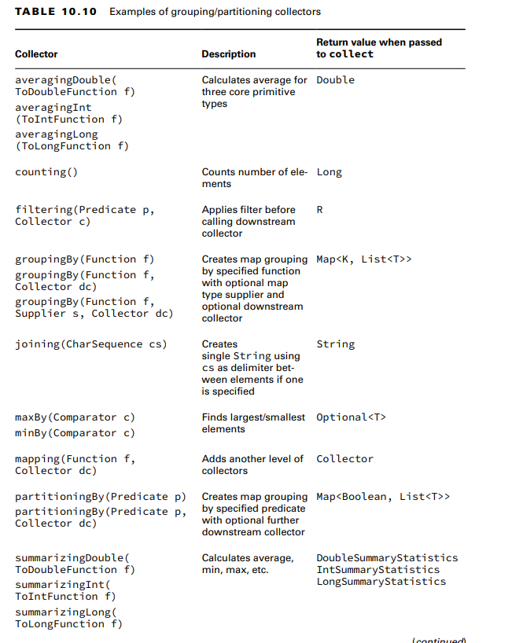
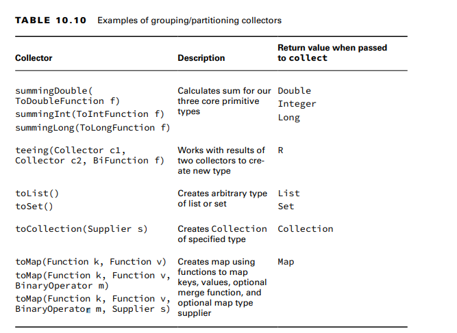

**Using a Spliterator**
It starts with a Collection or a stream—that is your bag of food. You call trySplit() to take some food out of the bag.
The rest of the food stays in the original Spliterator object.
Note that a Spliterator can have a number of characteristics such as CONCURRENT,
ORDERED, SIZED, and SORTED.

**Collecting Results**
    **Using Basic Collectors**
[this table is long as f]

**Collecting into Maps**
When creating a map, you need to specify two functions. The first function tells the
collector how to create the key.The second function tells the collector how to create the value.
var ohMy = Stream.of("lions", "tigers", "bears");Keys
Map<String, Integer> map = ohMy.collect(
Collectors.toMap(s -> s, String::length));Values
System.out.println(map); // {lions=5, bears=5, tigers=6}

**Grouping, Partitioning, and Mapping**
groupingBy() and partitioningBy().
- The groupingBy() collector tells collect() that it should group all the elements of
the stream into a Map. The function determines the keys in the Map. Each value in the Map is
a List of all entries that match that key. Note that the function you call in groupingBy() cannot return null. It
  does not allow null keys.
- artitioning is a special case of grouping. With partitioning, there are only two possible
  groups: true and false. Partitioning is like splitting a list into two parts.
-  a mapping() collector lets us go down a level and add another
   collector. mapping() takes two parameters: the function for the value and how to group it further.

**Teeing Collectors**
you can use teeing() to return multiple values of your own.
- First, define the return type. We use a record here:
record Separations(String spaceSeparated, String commaSeparated) {}

- Now we write the stream. As you read, pay attention to the number of Collectors:
var list = List.of("x", "y", "z");
Separations result = list.stream()
.collect(Collectors.teeing(--> combines the results into the single object we want to return.
Collectors.joining(" "), --> produces the values we want to return.
Collectors.joining(","),
(s, c) -> new Separations(s, c)));
System.out.println(result);

- When executed, the code prints the following:
Separations[spaceSeparated=x y z, commaSeparated=x,y,z]

Summary:
- An Optional<T> can be empty or store a value. You can check whether it contains a
  value with isPresent() and get() the value inside. You can return a different value
  with orElse(T t) or throw an exception with orElseThrow()
- There are even three methods that take functional interfaces as parameters: ifPresent(Consumer c),
  orElseGet(Supplier s), and orElseThrow(Supplier s).
- There are three optional types for primitives: OptionalDouble, OptionalInt, and OptionalLong. These have the
  methods getAsDouble(), getAsInt(), and getAsLong(), respectively
- A stream pipeline has three parts. The source is required, and it creates the data in the
  stream. There can be zero or more intermediate operations, which aren’t executed until the terminal operation runs.
- the Stream<T> class includes many useful intermediate operations including filter(), map(), flatMap(), and sorted().
- Besides the Stream<T> class, there are three primitive streams: DoubleStream,
  IntStream, and LongStream. In addition to the usual Stream<T> methods, IntStream
  and LongStream have range() and rangeClosed().
