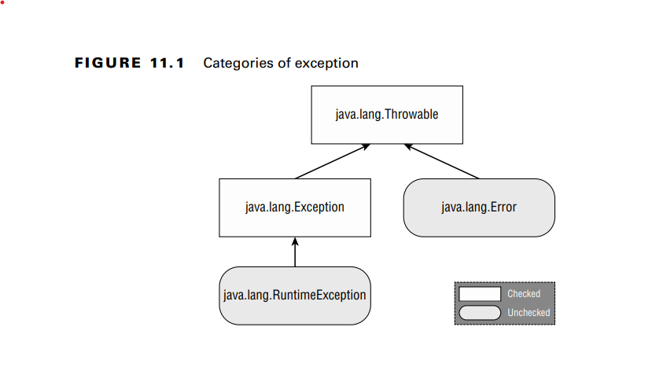

**Understanding Exception Types**

**Checked Exceptions**
A checked exception is an exception that must be declared or handled by the application
code where it is thrown. In Java, checked exceptions all inherit Exception but not
RuntimeException

The handle or declare rule means that all checked exceptions that could be thrown
within a method are either wrapped in compatible try and catch blocks or declared in the
method signature.
void fall(int distance) throws IOException {
if(distance > 10) {
throw new IOException();
}
}Now that you know how to declare an exception, how do you handle it?
alternate version of the fall() method handles the exception:
void fall(int distance) {
try {
if(distance > 10) {
throw new IOException();
}
} catch (Exception e) {
e.printStackTrace();
}Notice that the catch statement uses Exception, not IOException. Since
IOException is a subclass of Exception, the catch block is allowed to catch it
}

**Unchecked Exceptions**
- An unchecked exception is any exception that does not need to be declared or handled by
the application code where it is thrown.
- A runtime exception is defined as the RuntimeException class and its subclasses

**Error and Throwable**
-Error means something went so horribly wrong that your program should not attempt to
recover from it

IMPORTANT!!! Throwable is the parent class of all exceptions, including the Error class

Reviewing Exception Types

**Throwing an Exception**
PAY ATTENTION!!!!
On the exam, you will see two types of code that result in an exception
the first one is code thats wrong for example:
String[] animals = new String[0];
System.out.println(animals[0]); // ArrayIndexOutOfBoundsException
This code throws an ArrayIndexOutOfBoundsException since the array has no elements.

The second way for code to result in an exception is to explicitly request Java to throw
one. Java lets you write statements like these:
throw new Exception();
throw new Exception("Ow! I fell.");
throw new RuntimeException();
throw new RuntimeException("Ow! I fell.");

**IMPORTANT!!!!** throw vs throws
- the throw keyword is used as a statement inside a code block to throw a new exception
or rethrow an existing exception.
- the throws keyword is used only at the end of a method declaration to indicate what exceptions it supports

**Calling Methods That Throw Exceptions**

**Overriding Methods with Exceptions**
. An overridden method may not declare any new or broader checked  exceptions than the method it inherits
For example, this code isn’t allowed:
class CanNotHopException extends Exception {}
class Hopper {
public void hop() {}
}
class Bunny extends Hopper {
public void hop() throws CanNotHopException {} // DOES NOT COMPILE
}

An overridden method in a subclass is allowed to declare fewer exceptions than the superclass or interface. This is legal because callers are already handling them.
class Hopper {
public void hop() throws CanNotHopException {}
}
class Bunny extends Hopper {
public void hop() {} // This is fine
}

Printing an Exception

There are three ways to print an exception. You can let Java print it out, print just the message, or print where the stack trace comes from. This example shows all three approaches:
5: public static void main(String[] args) {
6: try {
7: hop();
8: } catch (Exception e) {
9: System.out.println(e + "\n");-> shows what Java prints out by default: the exception type and message.
10: System.out.println(e.getMessage()+ "\n"); ->second line shows just the message
11: e.printStackTrace();->The rest shows a stack trace
12: }
13: }
14: private static void hop() {
15: throw new RuntimeException("cannot hop");
16: }