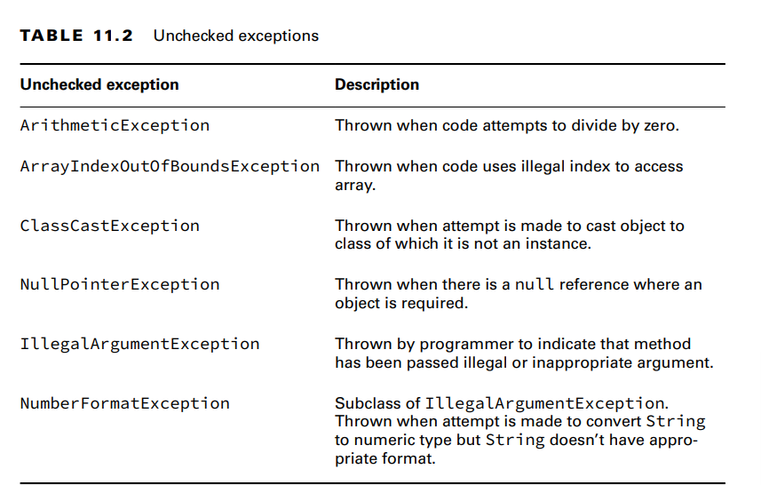
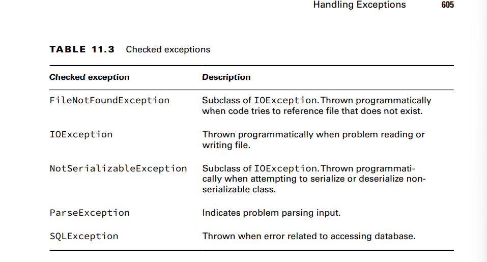
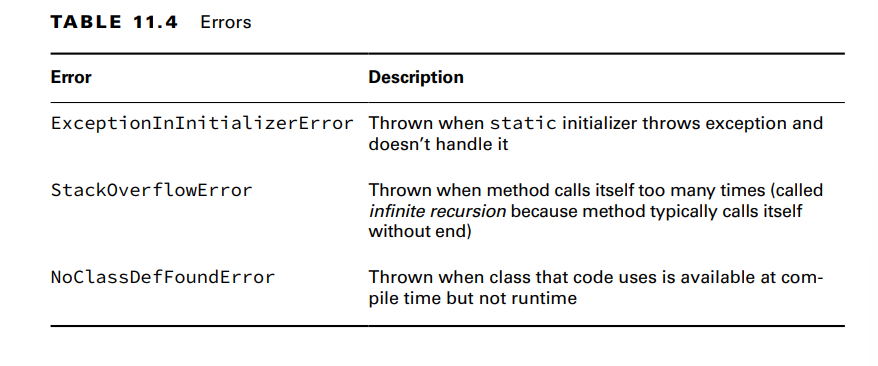

You need to recognize three groups of exception classes for the exam: RuntimeException,
checked Exception, and Error

**RuntimeException Classes**
RuntimeException and its subclasses are unchecked exceptions that don’t have to be handled or declared. 
They can be thrown by the programmer or the JVM.

    **ArithmeticException**
Trying to divide an int by zero gives an undefined result. When this occurs, the JVM will
throw an ArithmeticException:
Exception in thread "main" java.lang.ArithmeticException: / by zero

    **ArrayIndexOutOfBoundsException**
You know by now that array indexes start with 0 and go up to 1 less than the length of the
array—which means this code will throw an ArrayIndexOutOfBoundsException:
example:int[] countsOfMoose = new int[3];
System.out.println(countsOfMoose[-1]); since there is no such things as an negative array index it throws an exception.

    **ClassCastException**
this code doesn’t compile because Integer is not a subclass of String:
String type = "moose";
Integer number = (Integer) type; // DOES NOT COMPILE

    **NullPointerException**
Instance variables and methods must be called on a non-null reference. If the reference is null,
the JVM will throw a NullPointerException.

    **IllegalArgumentException**
is an error in a program that occurs when you pass a method an argument or input that it can't work with
or doesn't make sense. For example, if you have a method that expects a positive number as an argument, 
passing a negative number would result in an IllegalArgumentException because it's not a valid or acceptable 
input for that method.

    **NumberFormatException**
Java provides methods to convert strings to numbers. When these are passed an invalid
value, they throw a NumberFormatException.NumberFormatException is a subclass of
IllegalArgumentException. 

**Checked Exception Classes**
Checked exceptions have Exception in their hierarchy but not RuntimeException. They must be
handled or declared.
For the exam, you need to know that these are all checked exceptions that must be
handled or declared. You also need to know that FileNotFoundException and
NotSerializableException are subclasses of IOException

**Error Classes**
Errors are unchecked exceptions that extend the Error class. They are thrown by the JVM and
should not be handled or declared. Errors are rare, but you might see the ones listed in Table 11.4.
