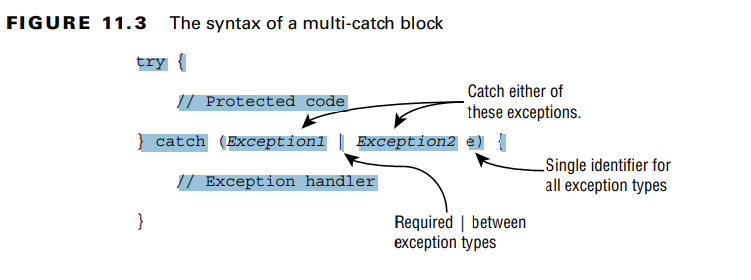

- **Using try and catch Statements** 
Java uses a try statement to separate the logic that might throw an exception from the logic to handle that
exception.
  try {
  // Protected code
  } catch (exception_type identifier) {
  // Exception handler

- **Chaining catch Blocks**
  A rule exists for the order of the catch blocks. Java looks at them in the order they appear. 

**Applying a Multi-catch Block**
A multi-catch block allows multiple exception types to be caught by the same catch block.
public static void main(String[] args) {
try {
System.out.println(Integer.parseInt(args[1]));
} catch (ArrayIndexOutOfBoundsException | NumberFormatException e) {
System.out.println("Missing or invalid input");
}
}

Syntax of multi- catch block:
try {
// Protected code
} catch (Exception1 | Exception2 e) {
// Exception handlerS

xRemember that the exceptions can
be listed in any order within the catch clause. However, the variable name must appear only
once and at the end. 
example: catch(Exception1 | Exception2 | Exception3 e)

try {
throw new IOException();
} catch (FileNotFoundException | IOException p) {} // DOES NOT COMPILE Since FileNotFoundException is a 
subclass of IOException, this code will not compile

**Adding a finally Block**
The try statement also lets you run code at the end with a finally clause, regardless of
whether an exception is thrown.
-there are two paths through code with both a catch and a finally. If an exception
is thrown, the finally block is run after the catch block. If no exception is thrown, the
finally block is run after the try block completes.
The catch block is not required if finally is present.

REMEMBER: If a try statement with a finally block is entered, then the finally block will always be executed, 
regardless of whether  the code completes successfully.
