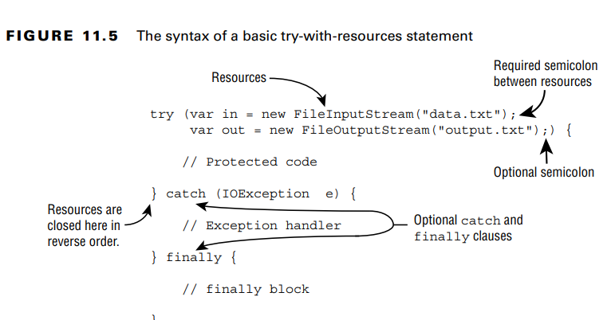

a resource is typically a file or database that requires some kind of stream
or connection to read or write data.

**Introducing Try-with-Resources**
try-with-resources statement to automatically close all resources opened in a try clause. 
This feature is also known as automatic resource management, because Java automatically takes care of the closing.
**Basics of Try-with-Resources**
Well, it turns out a catch block is optional with a try-with-resources statement.

- a try statement must have one or more catch
blocks or a finally block. A try-with-resources statement differs from a try statement in
that neither of these is required, although a developer may add both. For the exam, you need
to know that the implicit finally block runs before any programmer-coded ones.

**Constructing Try-with-Resources Statements**
Only classes that implement the AutoCloseable interface can be used in a try-with-resources
statement. the implemented version of close() can choose to throw Exception or a subclass or not throw any exceptions at all.
Since Closeable extends AutoCloseable, they are both supported in try-with-resources statements. The only difference between the two is that Closeable’s
close() method declares IOException, while AutoCloseable’s
close() method declares Exception

**Declaring Resources**
While try-with-resources does support declaring multiple variables, each variable must be
declared in a separate statement. Each resource must include the data type and
be separated by a semicolon (;).Declaring resources is a common situation where using var is quite helpful, as it shortens
the already long line of code.

**Following Order of Operations**
When working with try-with-resources statements, it is important to know that resources
are closed in the reverse of the order in which they are created

**Applying Effectively Final**
it is possible to declare them ahead of time, provided they are marked final or effectively final. The syntax uses the
resource name in place of the resource declaration, separated by a semicolon (;).

**Understanding Suppressed Exceptions**
Keep in mind that suppressed exceptions apply only to exceptions thrown in the try
clause
