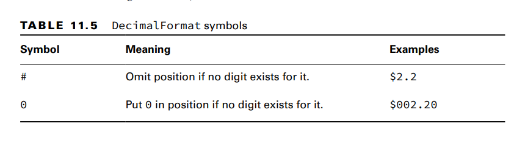
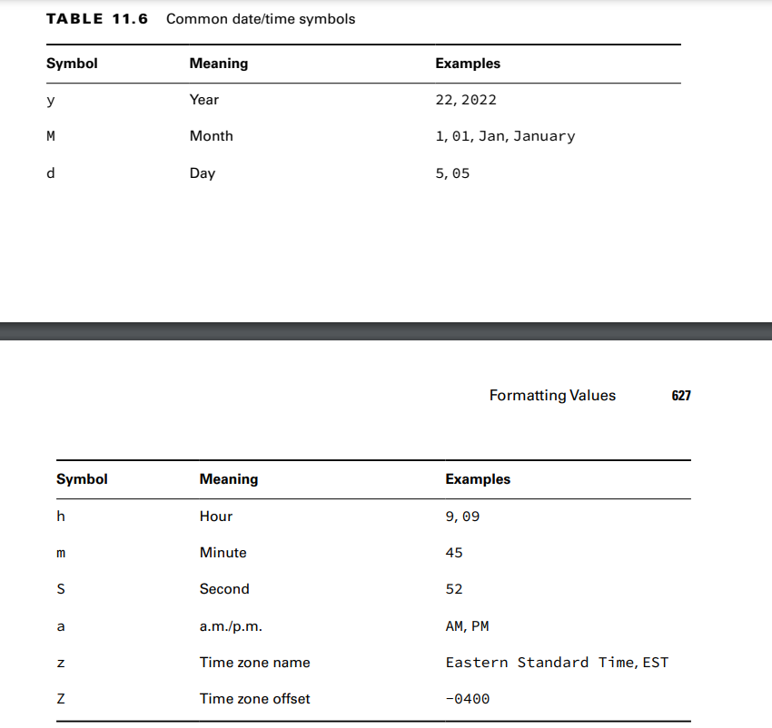
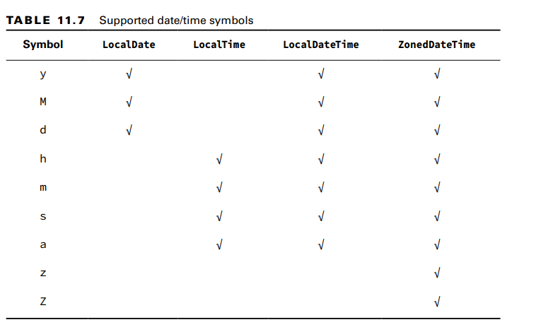

NumberFormat interface, which has two commonly used methods:
public final String format(double number)
public final String format(long number)
Since NumberFormat is an interface, we need the concrete DecimalFormat class to use
it. It includes a constructor that takes a pattern String:
public DecimalFormat(String pattern)

**Formatting Dates and Times**
Java provides a class called DateTimeFormatter to display standard formats.
**example**: LocalDate date = LocalDate.of(2022, Month.OCTOBER, 20);
LocalTime time = LocalTime.of(11, 12, 34); 
LocalDateTime dt = LocalDateTime.of(date, time);
System.out.println(date.format(DateTimeFormatter.ISO_LOCAL_DATE));//2022-10-20
System.out.println(time.format(DateTimeFormatter.ISO_LOCAL_TIME));//11:12:34
System.out.println(dt.format(DateTimeFormatter.ISO_LOCAL_DATE_TIME)); //2022-10-20T11:12:34
- The DateTimeFormatter will throw an exception if it encounters an incompatible type.

- **Customizing the Date/Time Format**
  DateTimeFormatter supports a custom format using a date format String.
  var f = DateTimeFormatter.ofPattern("MMMM dd, yyyy 'at' hh:mm");
  System.out.println(dt.format(f)); // October 20, 2022 at 11:12

- Learning the Standard Date/Time Symbols

- 

- **Selecting a format() Method**

The date/time classes contain a format() method that will take a formatter, while the formatter classes contain 
a format() method that will take a date/time value. The result is that either of the following is acceptable:
var dateTime = LocalDateTime.of(2022, Month.OCTOBER, 20, 6, 15, 30);
var formatter = DateTimeFormatter.ofPattern("MM/dd/yyyy hh:mm:ss");
System.out.println(dateTime.format(formatter)); // 10/20/2022 06:15:30
System.out.println(formatter.format(dateTime)); // 10/20/2022 06:15:30
These statements print the same value at runtime. Which syntax you use is up to you

