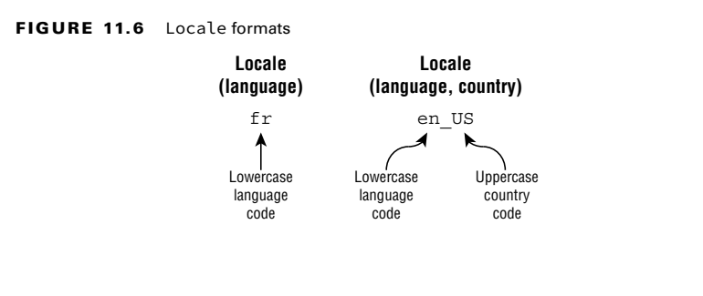
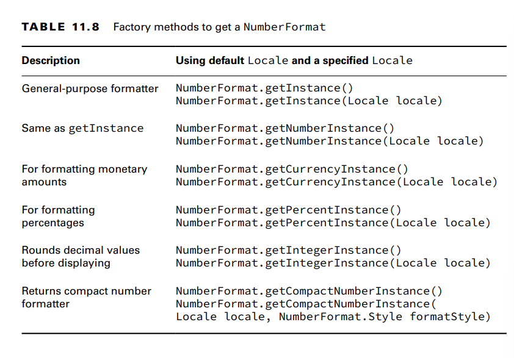
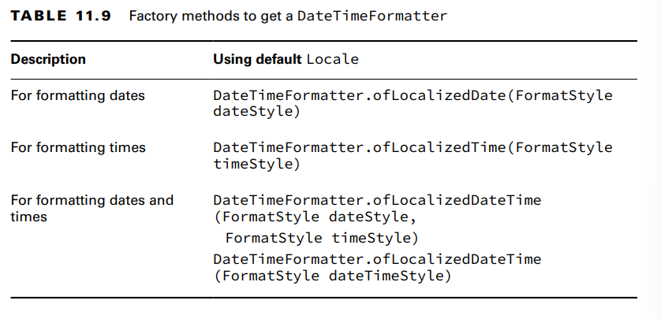
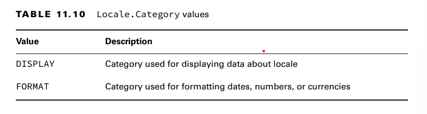

**Internationalization** is the process of designing your program so it can be adapted. This
involves placing strings in a properties file and ensuring that the proper data formatters are
used. 
**Localization** means supporting multiple locales or geographic regions. You can think
of a locale as being like a language and country pairing. Localization includes translating
strings to different languages. It also includes outputting dates and numbers in the correct
format for that locale.

**Picking a Locale**
The Locale class is in the java.util package.

-Notice the format. First comes the lowercase language code. The language is always
required. Then comes an underscore followed by the uppercase country code.

Pay attention to uppercase/lowercase and the underscore. For example, if you see a locale expressed as es_CO, then
you should know that the language is es and the country is CO, even if
you didn’t know that they represent Spanish and Colombia, respectively.

There are three common ways of doing this. 
- The first is to use the built-in constants in the Locale class, available for some common locales.

-The second way of selecting a Locale is to use the constructors to create a new object. You
can pass just a language, or both a language and country:
System.out.println(new Locale("fr")); // fr
System.out.println(new Locale("hi", "IN")); // hi_IN

-There’s a third way to create a Locale that is more flexible. The builder design pattern
lets you set all of the properties that you care about and then build the Locale at the end.
This means that you can specify the properties in any order. 

**Localizing Numbers**
The first step to formatting or parsing data is the same: obtain an instance of a
NumberFormat. Once you have the NumberFormat instance, you can call format() to turn a number into a
String, or you can use parse() to turn a String into a number.

**Formatting Numbers**
The NumberFormat.format() method formats the given number based on the
locale associated with the NumberFormat object.

just call NumberFormat.getInstance() and rely on the user’s default locale to format.

**Parsing Numbers**
When we parse data, we convert it from a String to a structured object or primitive
value. The NumberFormat.parse() method accomplishes this and takes the locale into
consideration.
-The parse() method, found in various types, declares a checked
exception ParseException that must be handled or declared in the
method in which it is called.The parse() method throws a checked ParseException, so make sure to
handle or declare it in your own code.
The parse() method is also used for parsing currency

**Formatting with CompactNumberFormat**

CompactNumberFormat:is similar to DecimalFormat, but it is designed to be used in places
where print space may be limited.
The following summarizes the rules for CompactNumberFormat:
■ First it determines the highest range for the number, such as thousand (K), million (M),
billion (B), or trillion (T).
■ It then returns up to the first three digits of that range, rounding the last digit as needed.
■ Finally, it prints an identifier. If SHORT is used, a symbol is returned. If LONG is used, a
space followed by a word is returned.

**Localizing Dates**

**Specifying a Locale Category**

When you call Locale.setDefault() with a locale, several display and formatting
options are internally selected. If you require finer-grained control of the default locale,
Java subdivides the underlying formatting options into distinct categories with the
Locale.Category enum.

The Locale.Category enum is a nested element in Locale that supports distinct
locales for displaying and formatting data 
together

- When you call Locale.setDefault() with a locale, the DISPLAY and FORMAT are set
together

calling Locale.setDefault(us) after the previous code snippet will change both locale categories to en_US.