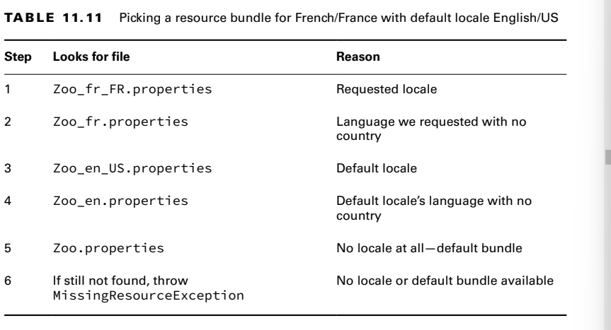
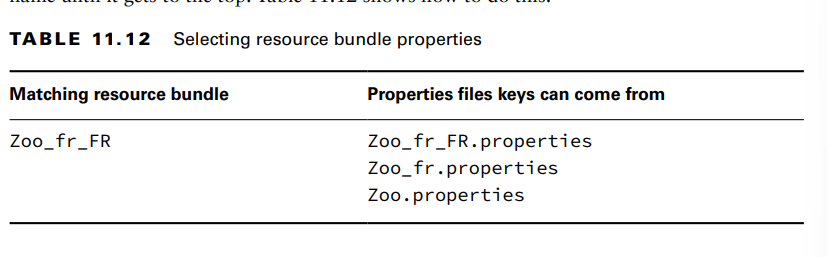

- A resource bundle contains the locale-specific objects to be used by a program. It is like a
map with keys and values. The resource bundle is commonly stored in a properties file.
- A properties file is a text file in a specific format with key/value pairs

**Creating a Resource Bundle**

**Picking a Resource Bundle**
There are two methods for obtaining a resource bundle that you should be familiar with
for the exam.

- The first uses the default locale
- the second Java handles the logic of picking the best available resource bundle for a given key. It tries
  to find the most specific value. T
     As another way of remembering the order of Table 11.11, learn these steps:
1. Look for the resource bundle for the requested locale, followed by the one for the
   default locale.
2. For each locale, check the language/country, followed by just the language.
3. Use the default resource bundle if no matching locale can be found

**Selecting Resource Bundle Values**

**Formatting Messages**

**Using the Properties Class**
The Properties class also includes a get() method, but only getProperty() allows for a default
value. For example, the following call is invalid since get() takes only a single parameter:
props.get("open"); // 10am
props.get("open", "The zoo will be open soon"); // DOES NOT COMPILE