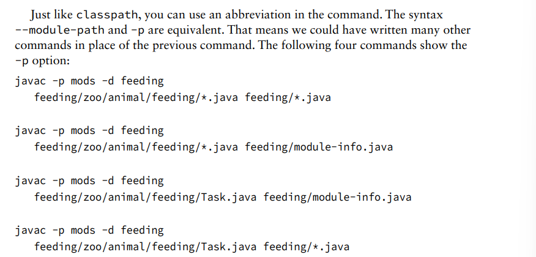

**Creating the Files**
There are a few key differences between a module declaration and a regular Java class
declaration:
■ The module-info.java file must be in the root directory of your module. Regular
Java classes should be in packages.
■ The module declaration must use the keyword module instead of class, interface, or enum.
■ The module name follows the naming rules for package names. It often includes periods
(.) in its name. Regular class and package names are not allowed to have dashes (-).
Module names follow the same rule

**Compiling Our First Module** 
**Running Our First Module**
--module-path uses the short form of -p,there is a short form of --module as well. The short option is -m. That
means the following command is equivalent:
java -p feeding
-m zoo.animal.feeding/zoo.animal.feeding.Task 

**Packaging Our First Module**
