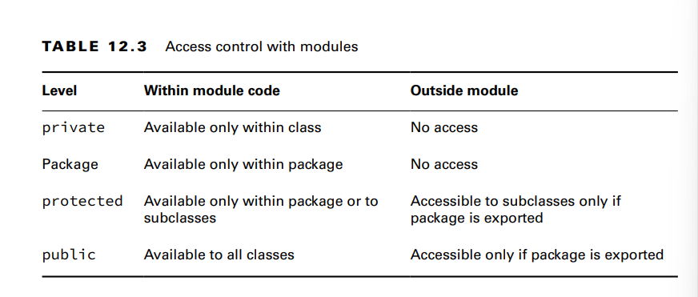

**Exporting a Package**
**Requiring a Module Transitively**
requires moduleName specifies that the current module
depends on moduleName. There’s also a requires transitive moduleName, which
means that any module that requires this module will also depend on moduleName.

**Duplicate requires Statements**
ava doesn’t allow you to repeat the same module in a requires clause. It is redundant and most likely an error in coding. Keep in mind that requires transitive is like
requires plus some extra behavior.

**Opening a Package**
- Java allows callers to inspect and call code at runtime with a technique called reflection.
- The opens directive is used to enable reflection of a package within a module. You
  only need to be aware that the opens directive exists rather than understanding it in detail
  for the exam