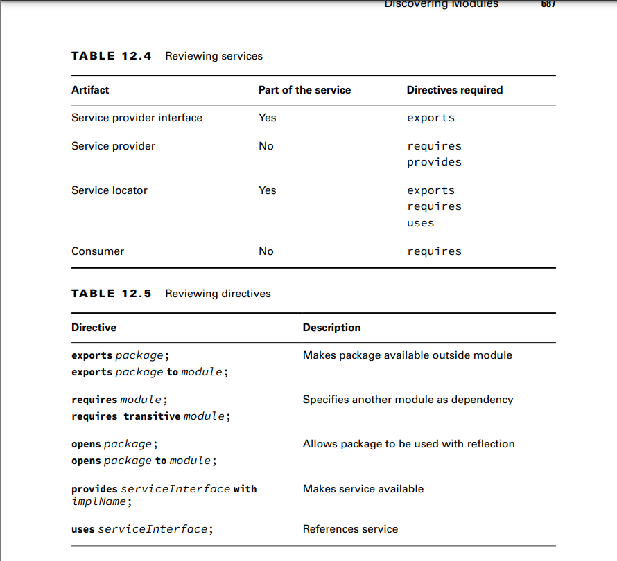

. A service is composed of an interface, any classes the interface references, and a way of looking up implementations 
of the interface
**Declaring the Service Provider Interfac**
To review, the service includes the service provider interface and supporting classes it references. 
The service also includes the lookup functionality

**Creating a Service Locator**
-A service locator can find any classes that implement a service provider interface.
**Invoking from a Consumer**
A consumer (or client) refers to a module that obtains and uses a service.
**Adding a Service Provider**
A service provider is the implementation of a service provider interface.
the provides directive. This allows us to specify that we
provide an implementation of the interface with a specific implementation class. The syntax
looks like this:
provides interfaceName with className;

**Reviewing Directives and Services**