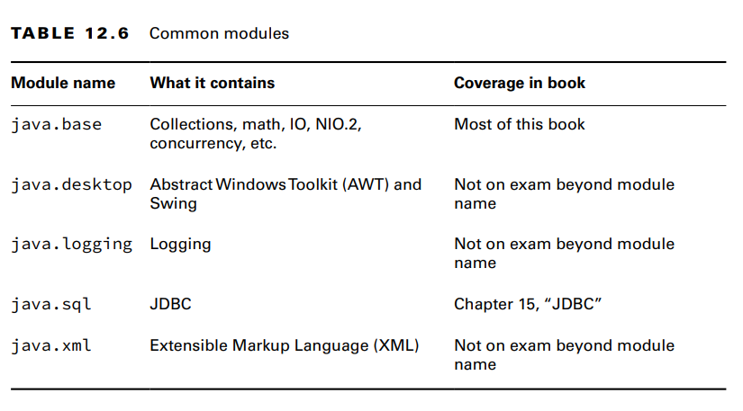
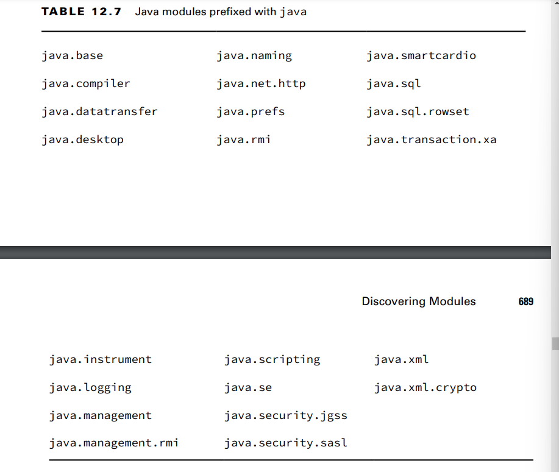
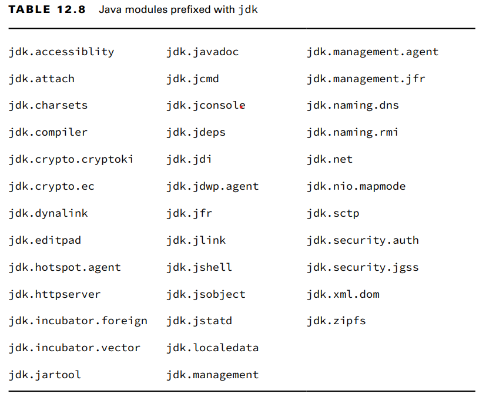
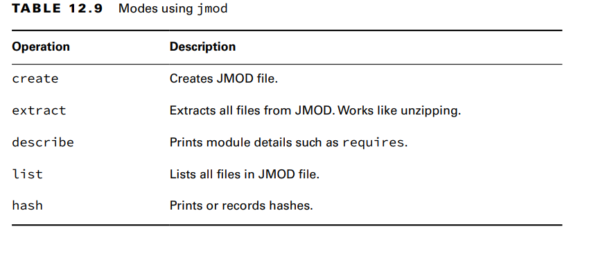
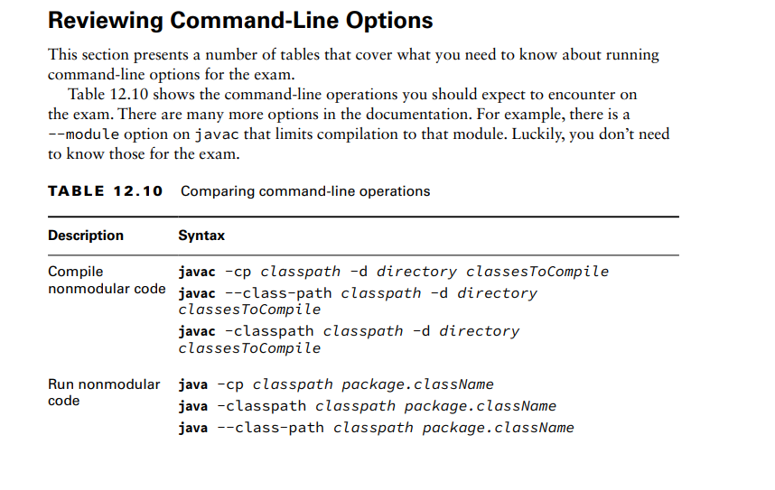
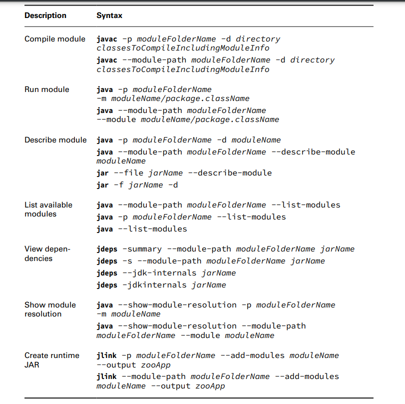
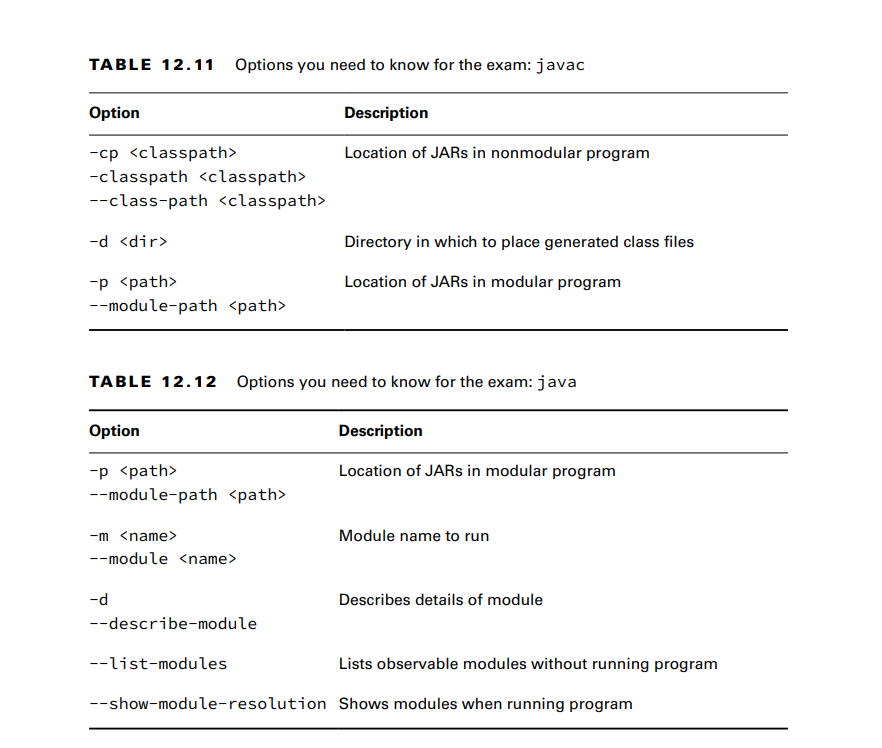
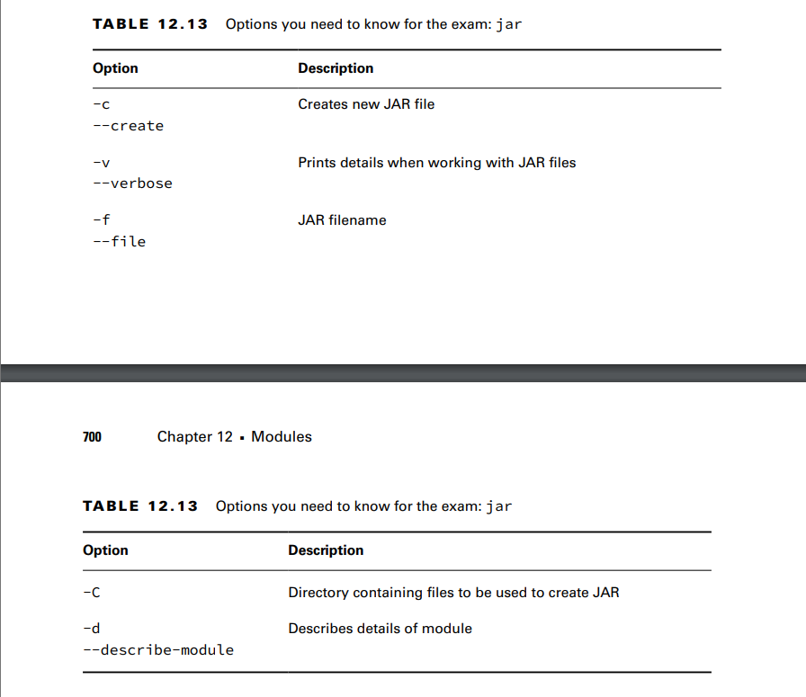
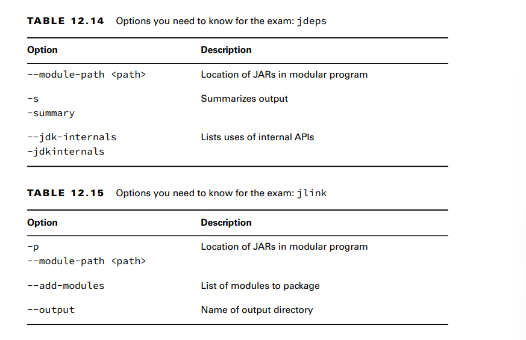

**Identifying Built-in Modules** 
The most important module to know is java.base.
[YOU DONT HAVE TO MEMORIZE THOSE]
**Getting Details with java**
The java command has three module-related options
    **Describing a Module**
    **Listing Available Modules**
COMMANF: java --list-modules
, you can use this command with custom code example:java -p mods --list-modules
    **Showing Module Resolution**
If listing the modules doesn’t give you enough output, you can also use the
--show-module-resolution option. You can think of it as a way of debugging modules. It spits
out a lot of output when the program starts up. Then it runs the program.

**Describing with jar**
Like the java command, the jar command can describe a module. 
**Learning about Dependencies with jdeps**
The jdeps command gives you information about dependencies within a module. Unlike
describing a module, it looks at the code in addition to the module declaration
**Using the --jdk-internals Flag**The --jdk-internals option lists any classes you are using that call an internal API
along with which API
**Using Module Files with jmod**
JMOD files are recommended only when you have native libraries or something that can’t go inside
a JAR file. **Jmod is only for working with the JMOD files**

 
