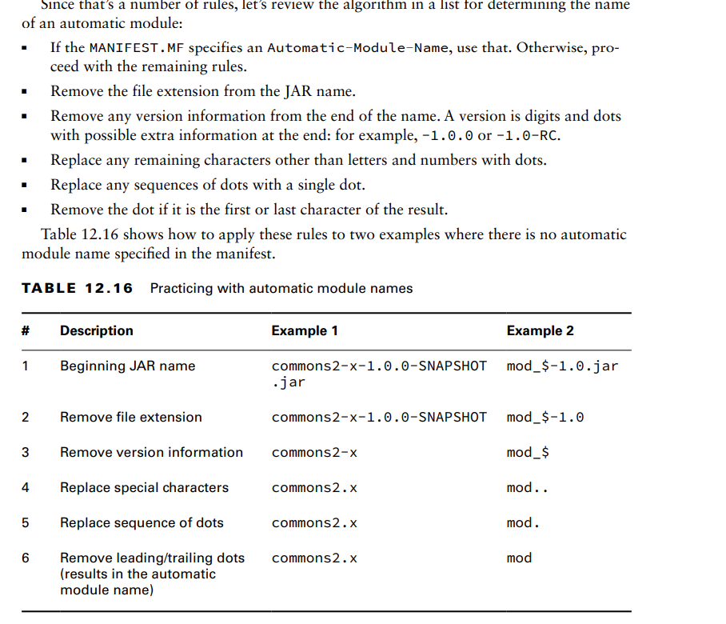
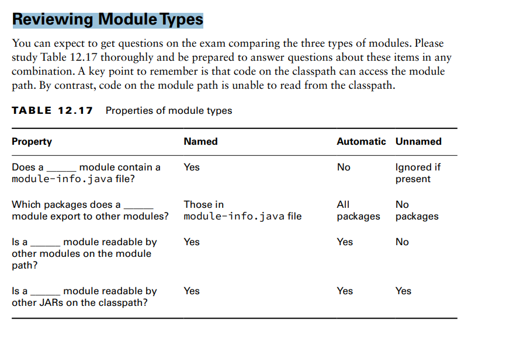

. There are two other types of modules: automatic modules and unnamed modules.

**Named Modules**
A named module is one containing a module-info.java file. To review, this file appears in
the root of the JAR alongside one or more packages

As a way of remembering this, a named module has the name inside the
module-info.java file and is on the module path.

**Automatic Modules**
An automatic module appears on the module path but does not contain a
module-info.java file. It is simply a regular JAR file that is placed on the module path
and gets treated as a module.

As a way of remembering this, Java automatically determines the module name 

**Unnamed Modules**
An unnamed module appears on the classpath. An unnamed module does not usually contain a module-info.java file
Unnamed modules do not export any packages to named or automatic modules.

**Reviewing Module Types**