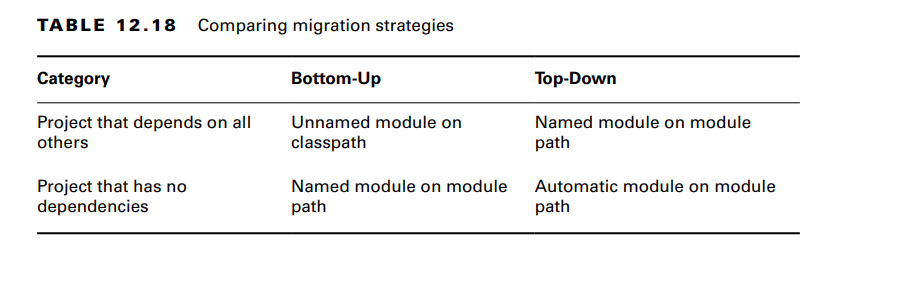

**Exploring a Bottom-Up Migration Strategy**
The easiest approach to migration is a bottom-up migration. For a bottom-up migration, you follow these steps:
1. Pick the lowest-level project that has not yet been migrated. (Remember the way we
   ordered them by dependencies in the previous section?)
2. Add a module-info.java file to that project. Be sure to add any exports to expose
   any package used by higher-level JAR files. Also, add a requires directive for any
   modules this module depends on.
3. Move this newly migrated named module from the classpath to the module path.
4. Ensure that any projects that have not yet been migrated stay as unnamed modules on
   the classpath.
5. Repeat with the next-lowest-level project until you are done.

During migration, you have a mix of named modules and unnamed modules. The named modules are the lower-level ones that 
have been migrated. They are on the module path and not allowed to access any unnamed modules.
The unnamed modules are on the classpath. They can access JAR files on both the classpath and the module path.

**Exploring a Top-Down Migration Strategy**

For a top-down migration, you follow these steps:
1. Place all projects on the module path.
2. Pick the highest-level project that has not yet been migrated.
3. Add a module-info.java file to that project to convert the automatic module into a
   named module. Again, remember to add any exports or requires directives. You can
   use the automatic module name of other modules when writing the requires directive
   since most of the projects on the module path do not have names yet.
4. Repeat with the next-highest-level project until you are done.

**Splitting a Big Project into Modules**
the first step is to break them into logical groupings and draw the dependencies between them

A cyclic dependency, or circular dependency, is when two things directly or indirectly depend on each other.

**Failing to Compile with a Cyclic Dependency**

**Summary**
- each module contains one or more packages and a module-info.java file.
-  The process of compiling and running modules uses the --module-path, also known
   as -p
- Running a module uses the --module option, also known as -m. The class to run is
  specified in the format moduleName/className.
- The exports directive specifies that a package should be accessible outside the module.
- The requires directive is used when a module depends on code in another module.
- requires transitive can be used when all modules that require one module should always require another
- The provides and uses directives are used when sharing and consuming a service
- the opens directive is used to allow access via reflection.
- Both the java and jar commands can be used to describe the contents of a module
- The jdeps command prints information about packages used in addition to module-level information.
- There are three types of modules:
    - Named modules contain a module-info.java file and are on the module path. They can read only from the module path
    - Automatic modules are also on the module path but have not yet been modularized
    - Unnamed modules are on the classpath.
- Top-down migration starts migrating the module with the most dependencies and places all
  other modules on the module path.
-  Bottom-up migration starts migrating a module with no dependencies and moves one module to the module path at a time
