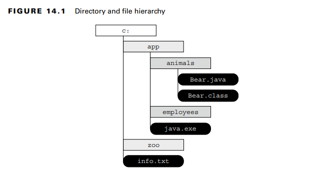
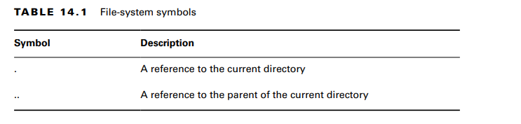
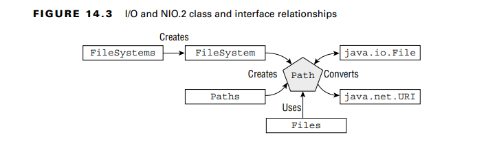
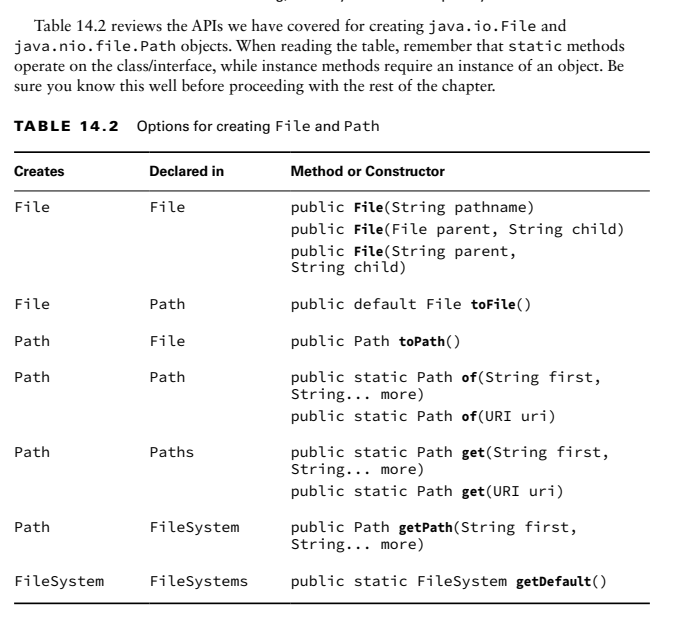

NIO stands for non-blocking input/output API and is sometimes referred to as new I/O. The exam covers NIO version 2.

**Conceptualizing the File System**
-The absolute path of a file or directory is the full path from the root directory to the file
or directory, including all subdirectories that contain the file or directory

- the relative path of a file or directory is the path from the current working directory to the file or directory.
  For example, the following is an absolute path to the Bear.java file:C:\app\animals\Bear.java
- exam, we adopt the following conventions:
  ■ If a path starts with a forward slash (/), it is absolute, with / as the root directory, such
  as /bird/parrot.png.
  ■ If a path starts with a drive letter (c:), it is absolute, with the drive letter as the root
  directory, such as C:/bird/info.
  ■ Otherwise, it is a relative path, such as bird/parrot.png

- A path symbol is one of a reserved series of characters with special meaning in some file systems
- A symbolic link is a special file within a file system that serves as a reference or pointer to another file or directory.
- While the I/O APIs do not support symbolic links, NIO.2 includes full support for creating, detecting, and navigating
  symbolic links within the file system.

**Creating a File or Path**
**Creating a File**
The File class is created by calling its constructor
**Creating a Path**
Since Path is an interface, we can’t create an instance directly.The simplest and most straightforward way to obtain
a Path object is to use a static factory method defined on Path or Paths.
examples:Path zooPath1 = Path.of("/home/tiger/data/stripes.txt");
Path zooPath4 = Paths.get("/home", "tiger", "data", "stripes.txt");

there are two ways of doing the same thing here:
- The Path.of() method & Paths.get() IMPORTANT: Note the s at the end of the Paths

**Obtaining a Path from the FileSystems Class**
he FileSystems class creates instances of the abstract FileSystem class.Both Paths.get() and Path.of() are shortcuts for this
FileSystem method.

**Reviewing I/O and NIO.2 Relationships** 