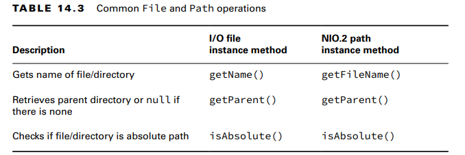
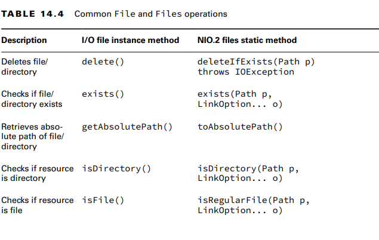
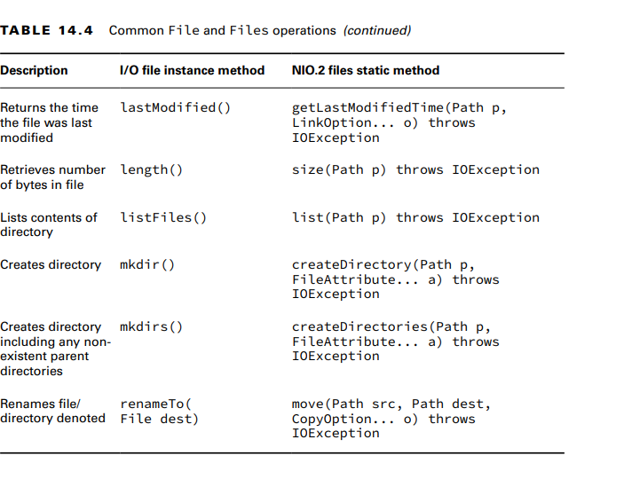
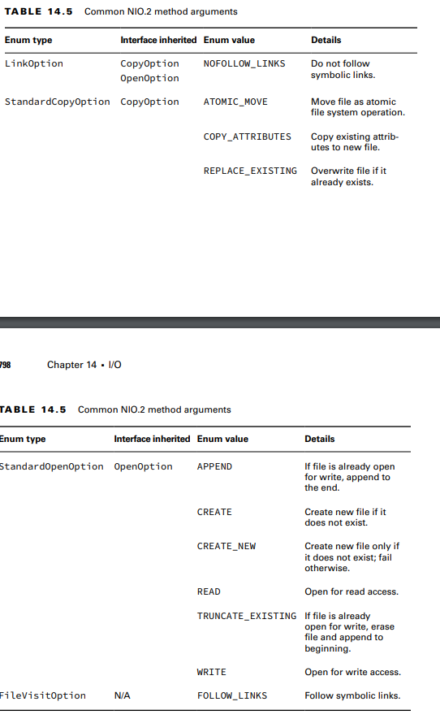
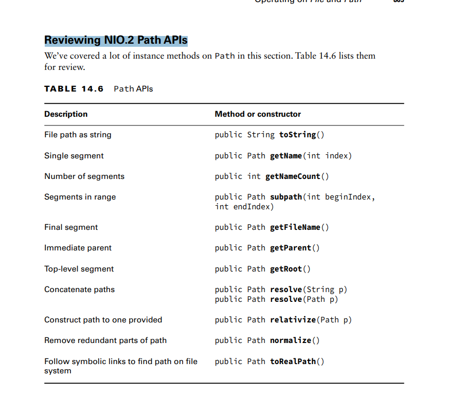
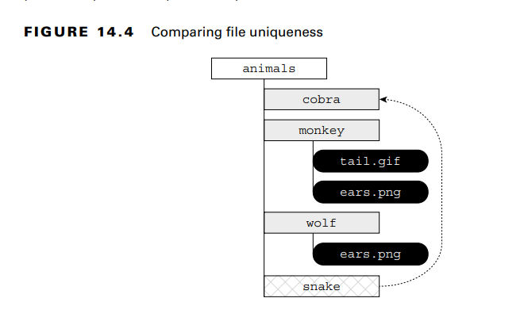

**Handling Methods That Declare IOException**
Common causes of a method throwing this exception include the following:
■ Loss of communication to the underlying file system.
■ File or directory exists but cannot be accessed or modified.
■ File exists but cannot be overwritten.
■ File or directory is required but does not exist.

There are exceptions to this rule, as we will see. For example, the method Files.exists() does not declare IOException

**Providing NIO.2 Optional Parameters**
**Interacting with NIO.2 Paths**
    **Viewing the Path**
The Path interface contains three methods to retrieve basic information about the path representation. 
- The toString() method returns a String representation of the entire path.t is the only method in the Path interface
to return a String
- The getNameCount() and getName() methods are often used together to retrieve the
number of elements in the path and a reference to each element, respectively. These two 
methods do not include the root directory as part of the path.
    **Creating Part of the Path**
The Path interface includes the subpath() method to select portions of a path. It takes two
parameters: an inclusive beginIndex and an exclusive endIndex.
- Like getNameCount() and getName(), subpath() is zero-indexed and does not
  include the root. Also like getName(), subpath() throws an exception if invalid indices
  are provided.
  var q = p.subpath(0, 4); // IllegalArgumentException
  var x = p.subpath(1, 1); // IllegalArgumentException
- **Accessing Path Elements**
- The getFileName() method returns the Path element of the current file or directory, 
- while getParent() returns the full path of the containing directory.
- The getParent() method returns null if operated on the root path or at the top of a relative
  path. 
- the getRoot() method returns the root element of the file within the file system, or null
  if the path is a relative path.

**Resolving Paths**
The resolve() method provides overloaded versions that let you pass either a Path or String
parameter. The object on which the resolve() method is invoked becomes the basis of the new
Path object, with the input argument being appended onto the Path.

Important!!! For the exam, you should be cognizant of mixing absolute and relative paths with the
resolve() method. If an absolute path is provided as input to the method, that is the value
returned. Simply put, you cannot combine two absolute paths using resolve().
**On the exam, when you see resolve(), think concatenation.**

**Relativizing a Path**
The Path interface includes a relativize() method for constructing the relative path from
one Path to another, often using path symbols.
- The relativize() method requires both paths to be absolute or relative and throws an exception if the types are mixed.
- 
**Normalizing a Path**
normalize() method to eliminate unnecessary redundancies in a path.
- **Remember**, the path symbol .. refers to the parent directory, while the path symbol . refers
to the current directory.
- The normalize() method also allows us to compare equivalent paths
- Consider the following example:
  var p1 = Paths.get("/pony/../weather.txt");
  var p2 = Paths.get("/weather.txt");
  System.out.println(p1.equals(p2)); // false
  System.out.println(p1.normalize().equals(p2.normalize())); // true

**Retrieving the Real File System Path**
toRealPath().
- This method is similar to normalize() in that it eliminates any redundant path symbols. 
It is also similar to toAbsolutePath(), in that it will join the path with the current working directory 
if the path is relative.
- Unlike those two methods, though, toRealPath() will throw an exception if the path does
not exist. In addition, it will follow symbolic links, with an optional LinkOption varargs
parameter to ignore them

**Reviewing NIO.2 Path APIs**

**Creating, Moving, and Deleting Files and Directories**
    **Making Directories**
To create a directory, we use these Files methods:
- public static Path createDirectory(Path dir,
    FileAttribute<?>... attrs) throws IOException

- public static Path createDirectories(Path dir,
      FileAttribute<?>... attrs) throws IOException

-The createDirectory() method will create a directory and throw an exception if it already exists
or if the paths leading up to the directory do not exist.

- the createDirectories() method creates the target directory along with any nonexistent
parent directories leading up to the path. If all of the directories already exist,
- createDirectories() will simply complete without doing anything.
- 
The following shows how to create directories:
  Files.createDirectory(Path.of("/bison/field"));
  Files.createDirectories(Path.of("/bison/field/pasture/green"));

    **Copying Files**
The Files class provides a method for copying files and directories within the file system.
public static Path copy(Path source, Path target,
CopyOption... options) throws IOException

- The method copies a file or directory from one location to another using Path objects.
  The following shows an example of copying a file and a directory:
  Files.copy(Paths.get("/panda/bamboo.txt"),
  Paths.get("/panda-save/bamboo.txt"));

- When directories are copied, the copy is shallow. A shallow copy means that the files and
  subdirectories within the directory are not copied. A deep copy means that the entire tree
  is copied, including all of its content and subdirectories. A deep copy typically requires
  recursion, where a method calls itself.

    **Copying and Replacing Files**
- By default, if the target already exists, the copy() method will throw an exception.
- You can change this behavior by providing the StandardCopyOption enum value REPLACE_EXISTING to the method.
- The following method call will overwrite the movie.txt file if it already exists:
Files.copy(Paths.get("book.txt"), Paths.get("movie.txt"),
  StandardCopyOption.REPLACE_EXISTING);
  
- For the exam, you need to know that without the REPLACE_EXISTING option, this
  method will throw an exception if the file already exists.

    **Copying Files with I/O Streams**
- The Files class includes two copy() methods that operate with I/O streams
- public static long copy(InputStream in, Path target,
  CopyOption... options) throws IOException //reads the contents of an I/O stream and writes the output to a file. 

- public static long copy(Path source, OutputStream out)
  throws IOException //reads the contents of a file and writes the output to an I/O stream.

    **Moving or Renaming Paths with move()**
- The Files class provides a useful method for moving or renaming files and directories.
  public static Path move(Path source, Path target,
  CopyOption... options) throws IOException

        **Similarities between move() and copy()**
- Like copy(), move() requires REPLACE_EXISTING to overwrite the target if it exists; otherwise, it will throw an exception.
- Also like copy(), move() will not put a file in a directory if the source is a file and the target is a directory. 
Instead, it will create a new file with the name of the directory.

    **Performing an Atomic Move**
- Another enum value that you need to know for the exam when working with the move() method is the StandardCopyOption 
value ATOMIC_MOVE. An atomic move is one in which a file is moved within the file system as a single indivisible operation.
  Files.move(Path.of("mouse.txt"), Path.of("gerbil.txt"),
  StandardCopyOption.ATOMIC_MOVE);

-if the file system does not support this feature, an AtomicMoveNotSupportedException will be thrown.
-while ATOMIC_MOVE is available as a member of the StandardCopyOption  type, it will likely throw an exception
if passed to a copy() method.

    **Deleting a File with delete() and deleteIfExists()**
The Files class includes two methods that delete a file or empty directory within the file system.
public static void delete(Path path) throws IOException
public static boolean deleteIfExists(Path path) throws IOException

- To delete a directory, it must be empty. Both of these methods throw an exception if operated on a nonempty directory

**Comparing Files with isSameFile() and mismatch()**
- the isSameFile() method. This method takes two Path objects as input,resolves all path symbols, and follows symbolic links
- 
- The mismatch() method  takes two Path objects as input.
  The method returns -1 if the files are the same; otherwise, it returns the index of the first
  position in the file that differs