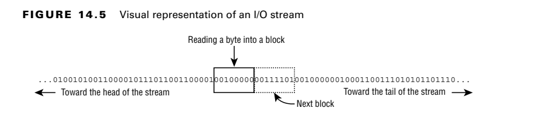
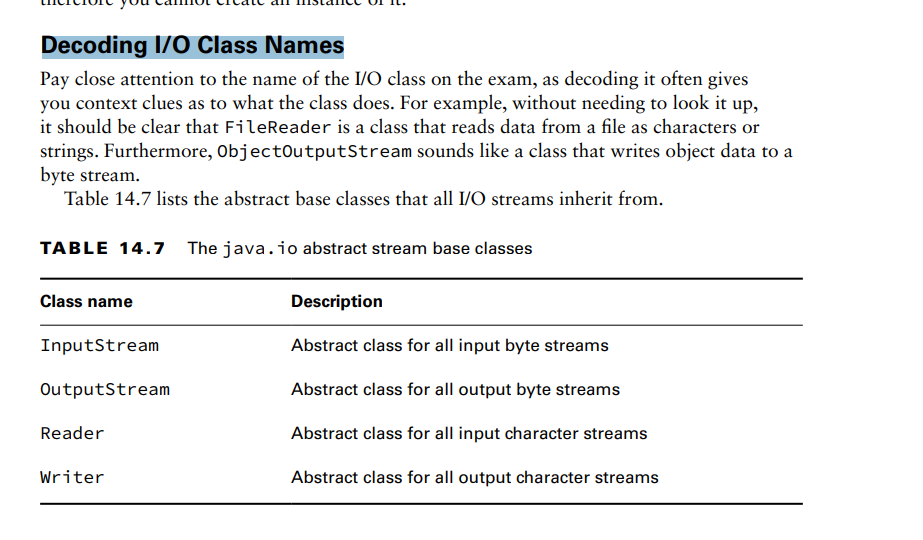
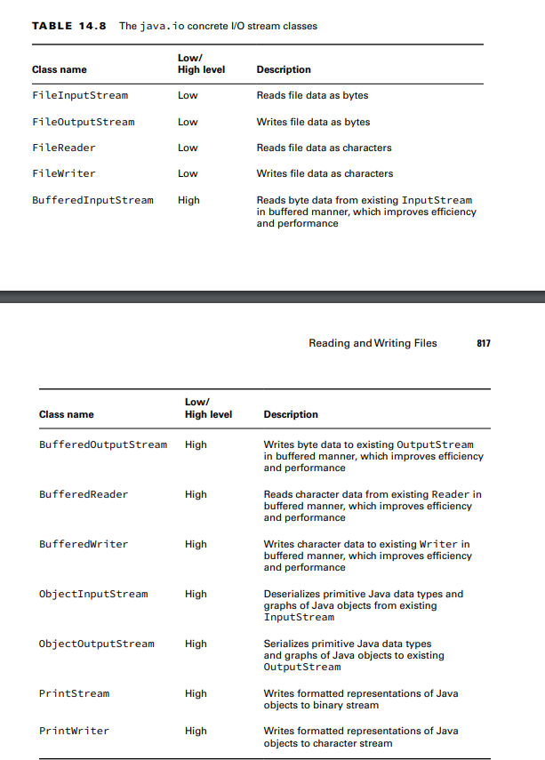

**Learning I/O Stream Nomenclature**

**SByte Streams vs. Character Streams**
The java.io API defines two sets of I/O stream classes for reading and writing I/O streams:
byte I/O streams and character I/O streams. We use both types of I/O streams throughout
this chapter.
Differences between Byte and Character I/O Streams
■ Byte I/O streams read/write binary data (0s and 1s) and have class names that end in
InputStream or OutputStream.
■ Character I/O streams read/write text data and have class names that end in Reader
or Writer.

**Input vs. Output Streams**
Most InputStream classes have a corresponding OutputStream class, and vice versa 
Exception:
PrintWriter has no accompanying PrintReader class. Likewise, the PrintStream is an OutputStream that has no
corresponding InputStream class. It also does not have Output in its name.

**Low-Level vs. High-Level Streams**
- A low-level stream connects directly with the source of the data, such as a file, an array, or
  a String
  - a high-level stream is built on top of another I/O stream using wrapping.
    -Wrapping is the process by which an instance is passed to the constructor of another class,
    and operations on the resulting instance are filtered and applied to the original instance.

**Stream Base Classes**
- The java.io library defines four abstract classes that are the parents of all I/O stream
classes defined within the API: InputStream, OutputStream, Reader, and Writer.

**Decoding I/O Class Names** 