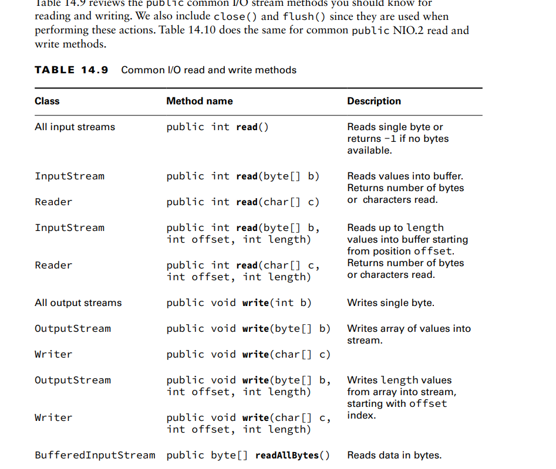
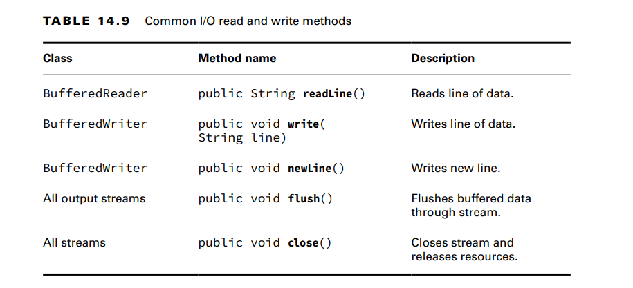
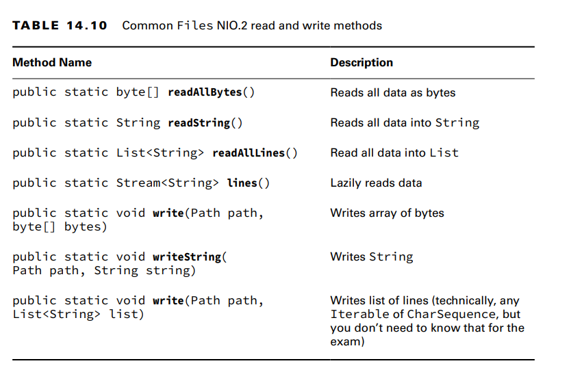

**Using I/O Streams**
I/O streams are all about reading/writing data.important methods are read() and write().
Both InputStream and Reader declare a read() method to read byte data from an I/O stream.Likewise, OutputStream and
Writer both define a write() method to write a byte to the stream:

**Enhancing with Files**
-Let’s start by looking at three ways of copying a file by reading in the data and writing it back:
private void copyPathAsString(Path input, Path output) throws IOException {
String string = Files.readString(input);
Files.writeString(output, string); //you can read a path as a String
}
private void copyPathAsBytes(Path input, Path output) throws IOException {
byte[] bytes = Files.readAllBytes(input);
Files.write(output, bytes);//you can read a path as a byte array
}
private void copyPathAsLines(Path input, Path output) throws IOException {
List<String> lines = Files.readAllLines(input);
Files.write(output, lines);//you can read a path as a list
}

**Combining with newBufferedReader() and newBufferedWriter()**
Sometimes you need to mix I/O streams and NIO.2. Conveniently, Files includes two convenience methods for getting I/O streams.
private void copyPath(Path input, Path output) throws IOException {
try (var reader = Files.newBufferedReader(input);
var writer = Files.newBufferedWriter(output)) {

**Reviewing Common Read and Write Methods**
  