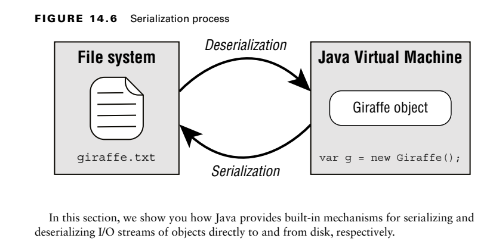

- Serialization is the process of converting an in-memory object to a
byte stream. 
- Likewise, deserialization is the process of converting from a byte stream into
an object. 
-  Serialization often involves writing an object to a stored or transmittable format,
while deserialization is the reciprocal process. 

**Applying the Serializable Interface**
to serialize an object using the I/O API, the object must implement the
java.io.Serializable interface.Any class can implement the Serializable interface since there are no required methods 
to implement.

**Marking Data transient**
The transient modifier can be used for sensitive data of the class, like a password.

**Ensuring That a Class Is Serializable**
Any process attempting to serialize an object will throw a NotSerializableException if the class does not implement
the Serializable interface properly.
How to Make a Class Serializable
■ The class must be marked Serializable.
■ Every instance member of the class must be serializable, marked transient, or have a
null value at the time of serialization.

**Storing Data with ObjectOutputStream and ObjectInputStream**
-The ObjectInputStream class is used to deserialize an object, while the ObjectOutputStream is used to serialize an object.

// ObjectInputStream
public Object readObject() throws IOException, ClassNotFoundException
// ObjectOutputStream
public void writeObject(Object obj) throws IOException

**Understanding the Deserialization Creation Process**
When you deserialize an object, the constructor of the serialized class, along with any instance initializers,
is not called when the object is created.
For the exam, make sure you understand that the constructor and any instance initializations defined in the serialized class are ignored during the deserialization process. Java only
calls the constructor of the first non-serializable parent class in the class hierarchy