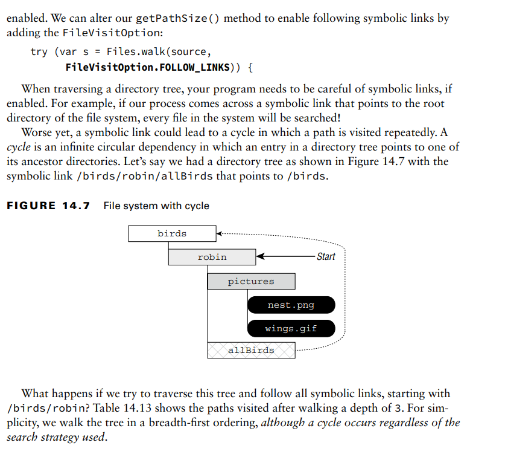

**Manipulating Input Streams**
All input stream classes include the following methods to manipulate the order in which data
is read from an I/O stream:
// InputStream and Reader
public boolean markSupported() //return I/O stream to an earlier position
public void mark(int readLimit)// before calling mark and reset()you call this first, it returns true only if mark() is supported.
public void reset() throws IOException//return I/O stream to an earlier position.
public long skip(long n) throws IOException//reads data from the I/O stream and discards the contents.

**Reviewing Manipulation APIs**

**Discovering File Attributes**
    **Checking for Symbolic Links**
While the File object can’t tell you if a reference is a symbolic link, the
isSymbolicLink() method on Files can.
System.out.print(Files.isDirectory(Paths.get("/canine/fur.jpg")));

**Checking File Accessibility**
The Files class includes methods that expose this information:
isHidden(), isReadable(), isWriteable(), and isExecutable().
A hidden file can’t normally be viewed when listing the contents of a directory
The readable, writable, and executable flags are important in file systems where the filename can be
viewed, but the user may not have permission to open the file’s contents, modify the file, or run the file as a program,
respectively.

**Improving Attribute Access**
NIO.2 addresses both of these concerns by allowing you to construct views for various
file systems with a single method call. A view is a group of related attributes for a particular file system type.

**Understanding Attribute and View Types**
NIO.2 includes two methods for working with attributes in a single method call: a read-only
attributes method and an updatable view method. For each method, you need to provide a
file system type object, which tells the NIO.2 method which type of view you are requesting.
** For the exam, you only need to know about the basic file attribute types.**

**Retrieving Attributes**
The Files class includes the following method to read attributes of a class in a readonly capacity:
public static <A extends BasicFileAttributes> A readAttributes(
Path path,
Class<A> type,
LinkOption... options) throws IOException
Applying it requires specifying the Path and BasicFileAttributes.class parameters.
The advantage of using this method, though, is that all the attributes are retrieved at once for some operating systems.

**Modifying Attributes**
The following Files method returns an updatable view:
public static <V extends FileAttributeView> V getFileAttributeView(
Path path,
Class<V> type,
LinkOption... options)
We can use the updatable view to increment a file’s last modified date/time value by 10,000 milliseconds, or 10 seconds.
After the updatable view is retrieved, we need to call readAttributes() on the view to
obtain the file metadata. From there, we create a new FileTime value and set it using the
setTimes() method:
// BasicFileAttributeView instance method
public void setTimes(FileTime lastModifiedTime,
FileTime lastAccessTime, FileTime createTime)
This method allows us to pass null for any date/time value that we do not want to modify.

**Traversing a Directory Tree**
While the Files.list() method is useful, it traverses the contents of only a single directory.
Traversing a directory, also referred to as walking a directory tree, is the process by which
you start with a parent directory and iterate over all of its descendants until some condition
is met or there are no more elements over which to iterate.

**Selecting a Search Strategy**
two common strategies are associated with walking a directory tree: 
a depth-first search :traverses the structure from the root to an arbitrary leaf and then navigates back up toward the root, traversing fully any paths it skipped
along the way
a breadth-first search:  breadth-first search starts at the root and processes all elements of each
particular depth before proceeding to the next depth level. The results are ordered by depth,
with all nodes at depth 1 read before all nodes at depth 2, and so on.

**For the exam, you don’t have to understand the details of each search strategy that Java
employs; you just need to be aware that the NIO.2 Stream API methods use depth-first
searching with a depth limit, which can be optionally changed.**

**Walking a Directory**
. The Files class
includes two methods for walking the directory tree using a depth-first search.
public static Stream<Path> **walk**(Path start,
FileVisitOption... options) throws IOException
public static Stream<Path> **walk**(Path start, int maxDepth,
FileVisitOption... options) throws IOException

. The Files class
includes two methods for walking the directory tree using a depth-first search.
public static Stream<Path> walk(Path start,
FileVisitOption... options) throws IOException
public static Stream<Path> walk(Path start, int maxDepth,
FileVisitOption... options) throws IOException

getPathSize() method walks a directory tree and returns
the total size of all the files in the directory

**Applying a Depth Limit**
Let’s say our directory tree is quite deep, so we apply a depth limit by changing one line of
code in our getPathSize() method.
try (var s = Files.walk(source, 5)) {

**Avoiding Circular Paths**
Be aware that when the FOLLOW_LINKS option is used, the walk() method will track all
of the paths it has visited, throwing a FileSystemLoopException if a path is visited twice

**Searching a Directory**
The find() method behaves in a similar manner as the walk() method, except that it
takes a BiPredicate to filter the data. It also requires a depth limit to be set. Like walk(),
find() also supports the FOLLOW_LINK option.

The two parameters of the BiPredicate are a Path object and a BasicFileAttributes object

