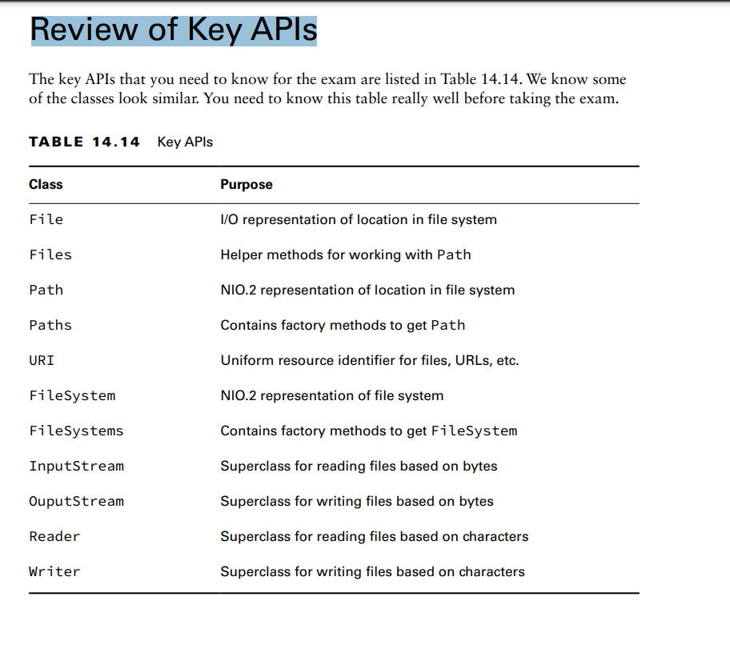
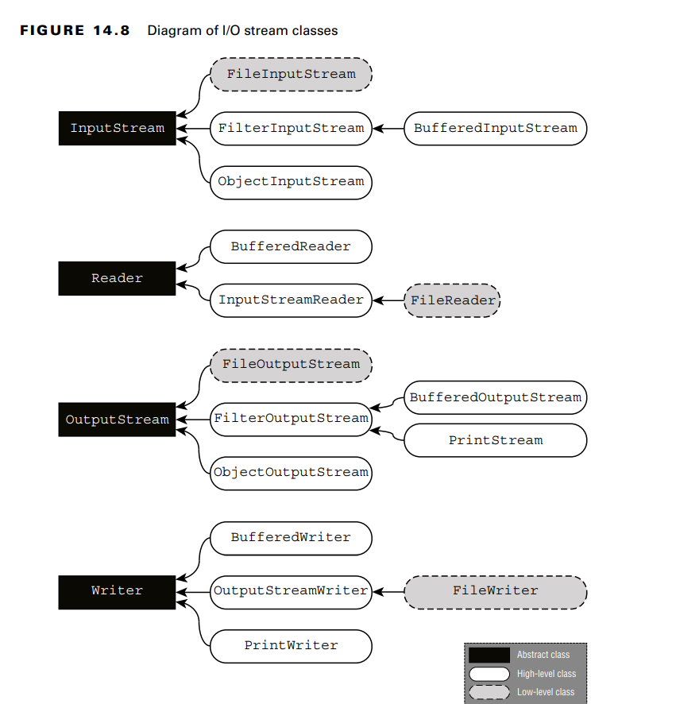

FilterInputStream and
FilterOutputStream are high-level superclasses that filter or transform data. They are
rarely used directly.

Summary:
We then introduced I/O streams and explained how they are used to read or write large
quantities of data. While there are a lot of I/O streams, they differ on some key points:
■ Byte vs. character streams
■ Input vs. output streams
■ Low-level vs. high-level streams