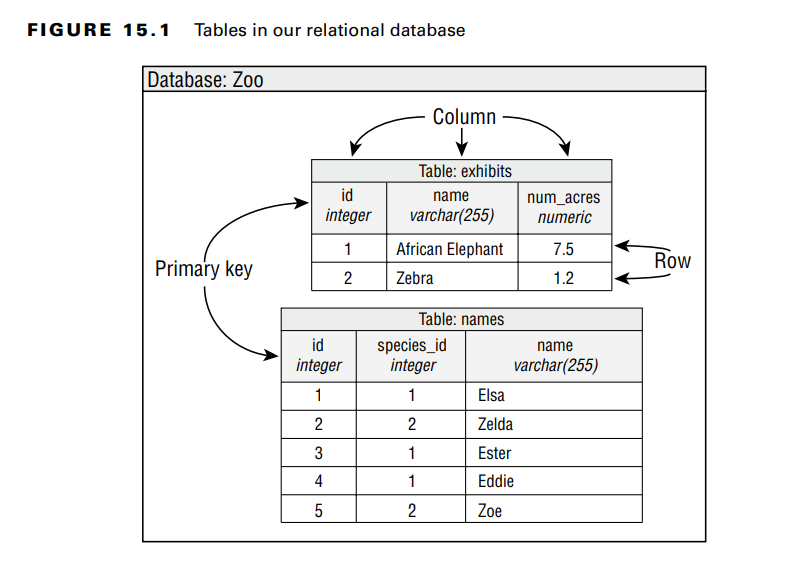
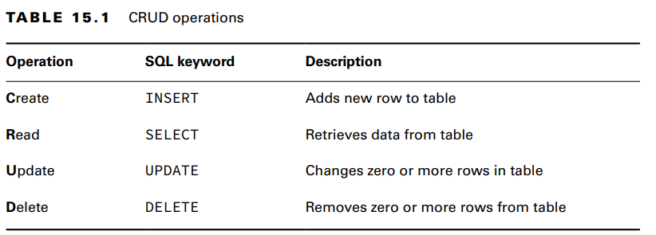
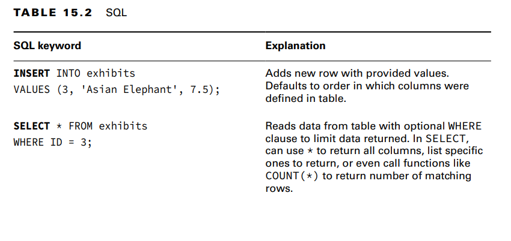
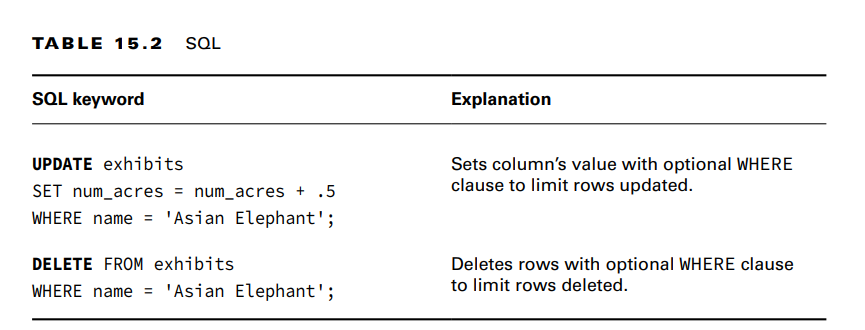

A database is an organized collection of data.
A relational database is a database that is organized into tables, which consist of rows
and columns. You can think of a table as a spreadsheet. There are two main ways to access a
relational database from Java:
■ Java Database Connectivity (JDBC): Accesses data as rows and columns. JDBC is the
API covered in this chapter.
■ Java Persistence API (JPA): Accesses data through Java objects using a concept called
object-relational mapping (ORM). 

A relational database is accessed through Structured Query Language (SQL). SQL is a
programming language used to interact with database records. JDBC works by sending a
SQL command to the database and then processing the response.

Identifying the Structure of a Relational Database

**Writing Basic SQL Statements**
there are four types of statements for working with the data in tables. They are referred to as
CRUD (Create, Read, Update, Delete). The SQL keywords don’t match the acronym, so pay
attention to the SQL keyword for each Unlike Java, SQL keywords are case insensitive.

