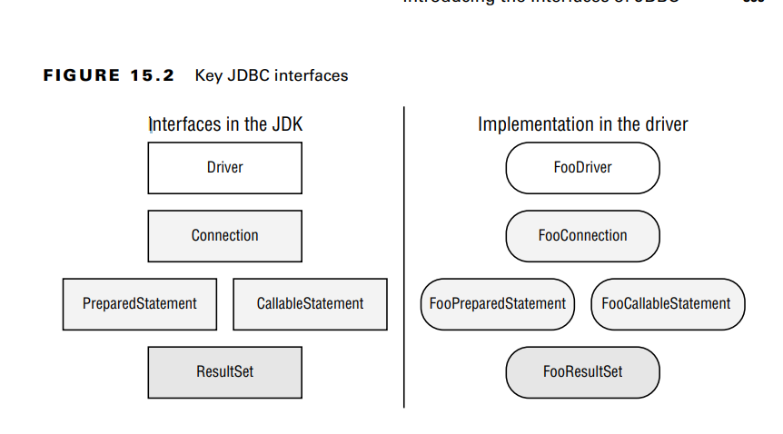

With JDBC, you use only the interfaces in your code and never the implementation classes directly. In fact, they might
not even be public classes.
What do these five interfaces do? On a very high level, we have the following:
■ Driver: Establishes a connection to the database
■ Connection: Sends commands to a database
■ PreparedStatement: Executes a SQL query
■ CallableStatement: Executes commands stored in the database
■ ResultSet: Reads the results of a query

All database interfaces are in the package java.sql
