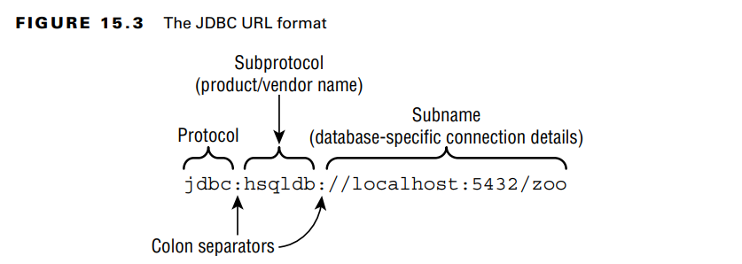

The first step in doing anything with a database is connecting to it.

**Building a JDBC URL**
DBC URLs have a variety of formats. They have three parts in common,
- the first piece is always the same. It is the protocol jdbc.
-The second part is the subprotocol, which is the name of the database, such as hsqldb, mysql,
or postgres. 
- The third part is the subname, which is a database-specific format. Colons (:)
separate the three parts.The subname typically contains information about the database such as its location
  and/or name. The syntax varies
- jdbc:hsqldb://localhost:5432/zoo
 
**Getting a Database Connection**
There are two main ways to get a Connection: DriverManager and DataSource

-The DriverManager class is in the JDK, as it is an API that comes with Java. It uses the
factory pattern, which means that you call a static method to get a Connection rather
than calling a constructor.

-getConnection(). To get a Connection from the HyperSQL database, you write the following:
import java.sql.*;
public class TestConnect {
public static void main(String[] args) throws SQLException {
try (Connection conn = DriverManager.getConnection("jdbc:hsqldb:file:zoo")) {
System.out.println(conn);
} } }

Notice the three parameters that are passed to getConnection().:
- the first is the JDBC URL 
- The second is the username for accessing the database
-  the third is the password for accessing the database.