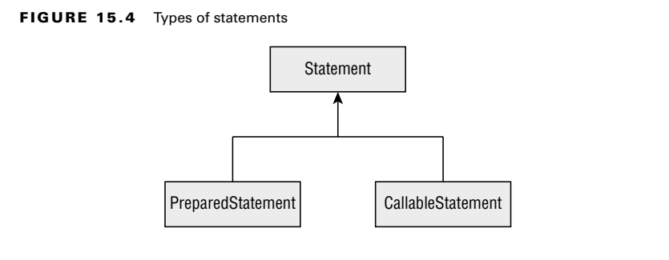
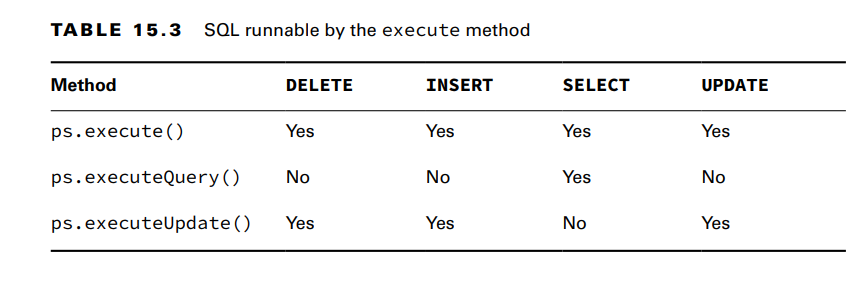
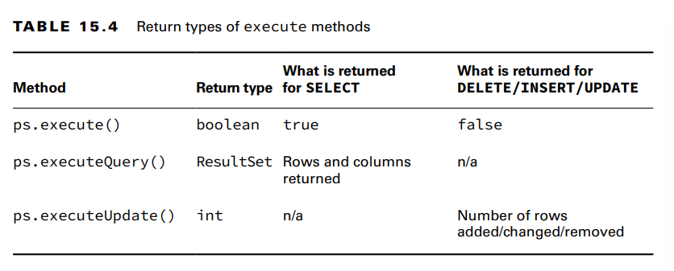
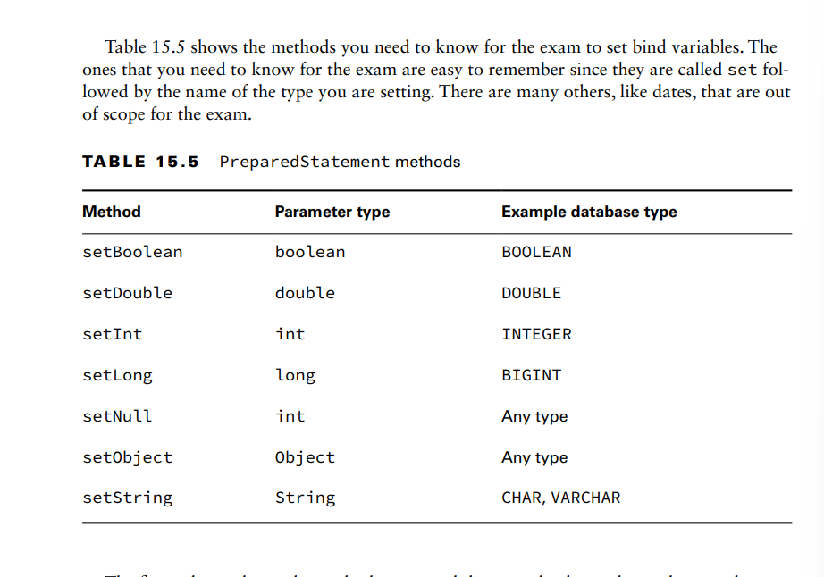

In Java, you have a choice of working with a Statement, PreparedStatement, or
CallableStatement.

a PreparedStatement takes parameters, while a Statement does not. A Statement just executes w.e SQL query you give it.
PreparedStatement is far superior for the following reasons:
■ Performance: In most programs, you run similar queries multiple times. When you use
PreparedStatement, the database software often devises a plan to run the query well
and remembers it.
■ Security: You are protected against an attack called SQL injection when using a
PreparedStatement correctly.
■ Readability: It’s nice not to have to deal with string concatenation in building a query
string with lots of parameters.
■ Future use: Even if your query is being run only once or doesn’t have any parameters,
you should still use a PreparedStatement. That way, future editors of the code won’t
add a variable and have to remember to change to PreparedStatement then.

**Obtaining a PreparedStatement**
To run SQL, you need to tell a PreparedStatement about it. Getting a PreparedStatement from
a Connection is easy.
try (PreparedStatement ps = conn.prepareStatement(
"SELECT * FROM exhibits")) {
// work with ps
}

Passing a SQL statement when creating the object is mandatory. You might see a trick
on the exam.

**Executing a PreparedStatement**
    **Modifying Data with executeUpdate()**
let’s start with statements that change the data in a table. Those are SQL statements that
begin with DELETE, INSERT, or UPDATE. They typically use a method called executeUpdate(). 
    **Reading Data with executeQuery()**
Next, let’s look at a SQL statement that begins with SELECT. This time, we use the
executeQuery() method.
30: var sql = "SELECT * FROM exhibits";
31: try (var ps = conn.prepareStatement(sql);
32: ResultSet rs = ps.executeQuery() ) {
33:
34: // work with rs
35: }ince we are running a query to get a result, the return type is ResultSet

    **Processing Data with execute()**
There’s a third method called execute() that can run either a query or an update. It returns
a boolean so that we know whether there is a ResultSet. That way, we can call the proper
method to get more detail. The pattern looks like this:
boolean isResultSet = ps.execute();
if (isResultSet) {
try (ResultSet rs = ps.getResultSet()) {
System.out.println("ran a query");
}
} else {
int result = ps.getUpdateCount();
System.out.println("ran an update");
}If the PreparedStatement refers to sql that is a SELECT, the boolean is true, and we
can get the ResultSet. If it is not a SELECT, we can get the number of rows updated.

**Using the Correct Method**
We can’t get a compiler error since the SQL is a String. We can get an exception,
though, and we do. We also get a SQLException when using executeQuery() with SQL
that changes the database.Again, we get an exception because the driver can’t translate the query into the expected
return type.

**Reviewing PreparedStatement Methods**

**Working with Parameters**
A bind variable is a placeholder that lets you specify the actual values at runtime
String sql = "INSERT INTO names VALUES(?, ?, ?)";
Bind variables make the SQL easier to read since you no longer need to use quotes
around String values in the SQL

