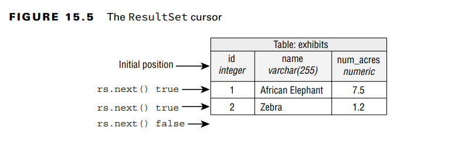
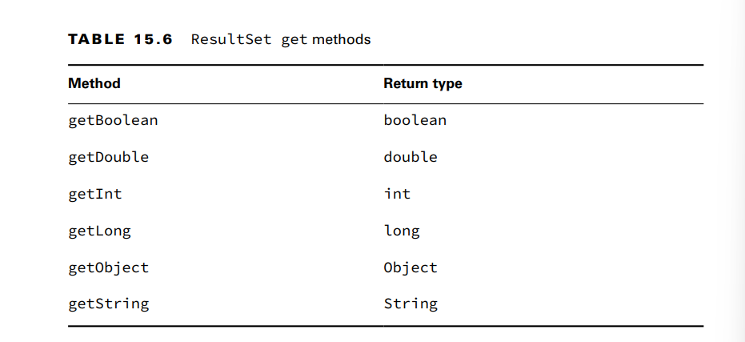

**Reading a ResultSet**
When working with a ResultSet, most of the time, you will write a loop to look at each row.

A ResultSet has a cursor, which points to the current location in the data

It is important to check that rs.next() returns true before trying to call a getter on the
ResultSet. If a query didn’t return any rows, it would throw a SQLException, so the if
statement checks that it is safe to call. Alternatively, you can use the column name.
Not calling rs.next() at all is a problem. The result set cursor is still pointing to a location before the first row, so the getter has nothing to point to.
To sum up this section, it is important to remember the following:
■ Always use an if statement or while loop when calling rs.next().
■ Column indexes begin with 1.

**Getting Data for a Column**
The getObject() method can return any type. For a primitive, it uses the wrapper class.

**Using Bind Variables**
var sql = "SELECT id FROM exhibits WHERE name = ?";
31:
32: try (var ps = conn.prepareStatement(sql)) { First we create the PreparedStatement
33: ps.setString(1, "Zebra"); then, we set the bind variable
34:
35: try (var rs = ps.executeQuery()) { It is only after these are both done that we have a nested
try-with-resources
36: while (rs.next()) {create result set
37: int id = rs.getInt("id");
38: System.out.println(id);
39: }
40: }
41: }