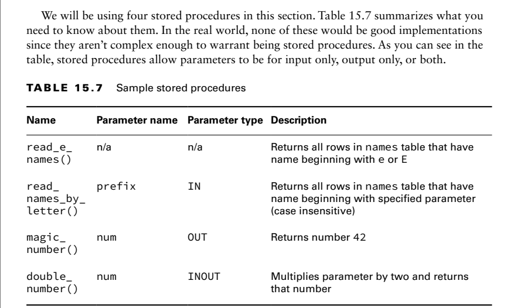
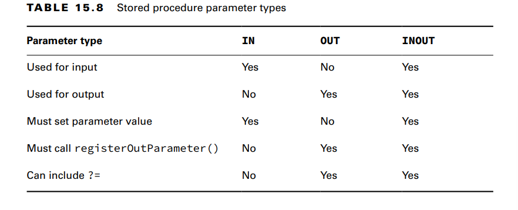

A stored procedure is code that is compiled in advance and stored in the database. Stored
procedures are commonly written in a database-specific variant of SQL, which varies among
database software providers.

**Calling a Procedure without Parameters**
A stored procedure is called by putting the word call and the procedure name in braces ({})

**Passing an IN Parameter**
The read_names_by_letter() stored procedure takes a parameter for the prefix or first letter
of the stored procedure. An IN parameter is used for input.
Unlike with PreparedStatement, we can use
either the parameter number (starting with 1) or the parameter name. That means these two
statements are equivalent:
cs.setString(1, "Z");
cs.setString("prefix", "Z");

**Working with an INOUT Parameter**
Finally, it is possible to use the same parameter for both input and output
Remember that an INOUT parameter acts as both an IN parameter and an OUT parameter,
so it has all the requirements of both.

**Comparing Callable Statement Parameters**

**Using Additional Options**
There are three ResultSet integer type values:
■ ResultSet.TYPE_FORWARD_ONLY: Can go through the ResultSet only one
row at a time
■ ResultSet.TYPE_SCROLL_INSENSITIVE: Can go through the ResultSet in any
order but will not see changes made to the underlying database table
■ ResultSet.TYPE_SCROLL_SENSITIVE: Can go through the ResultSet in any order
and will see changes made to the underlying database table
There are two ResultSet integer concurrency mode values:
■ ResultSet.CONCUR_READ_ONLY: The ResultSet cannot be updated.
■ ResultSet.CONCUR_UPDATABLE: The ResultSet can be updated.