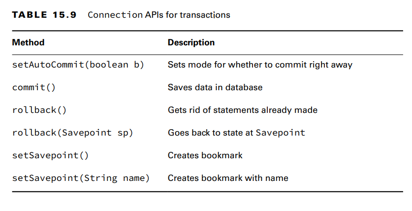

- A transaction is when one or more statements are grouped with the final results committed or rolled back.
- Rollback is like closing a file without saving. All the changes from the start of the transaction are discarded. 

**Committing and Rolling Back**
public static void main(String[] args) throws SQLException {
6: try (Connection conn =
7: DriverManager.getConnection("jdbc:hsqldb:file:zoo")) {
8:
9: conn.setAutoCommit(false); // we turn off autocommit
10:
11: var elephantRowsUpdated = updateRow(conn, 5, "African Elephant");
12: var zebraRowsUpdated = updateRow(conn, -5, "Zebra");
13:
14: if (! elephantRowsUpdated || ! zebraRowsUpdated)
15: conn.rollback();//we roll back the transaction when no rows are updated

**Bookmarking with Savepoints**
You can use savepoints to have more control of the rollback point.
**Reviewing Transaction APIs**
