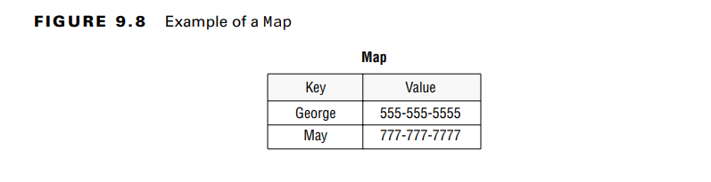
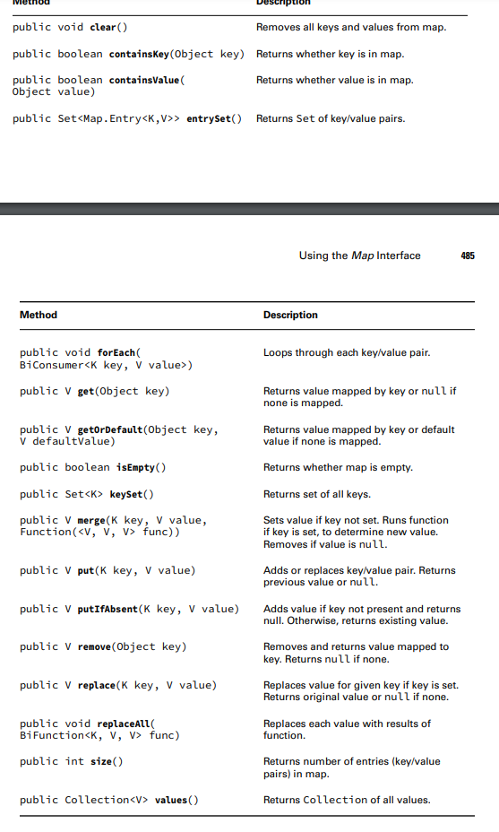
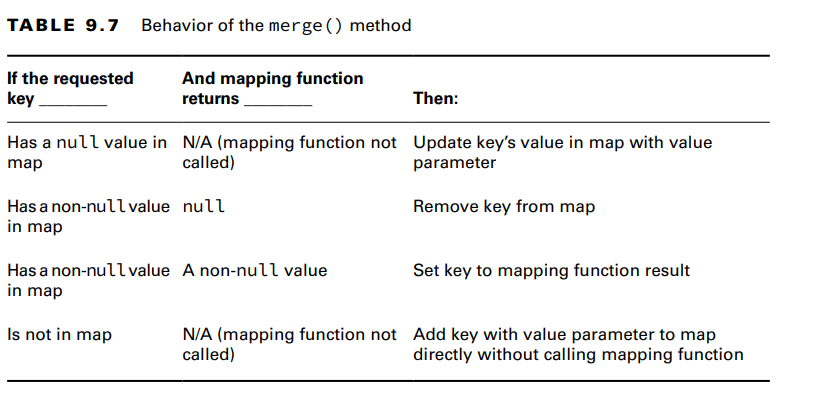

You use a Map when you want to identify values by a key 
The main thing that all Map classes have in common is that they have keys and values. 
Beyond that, they each offer different functionality

Comparing Map Implementations
A HashMap stores the keys in a hash table. This means that it uses the hashCode() method of
the keys to retrieve their values more efficiently

A TreeMap stores the keys in a sorted tree structure. The main benefit is that the keys are
always in sorted order. Like a TreeSet, the trade-off is that adding and checking whether a
key is present takes longer as the tree grows larger

**Working with Map Methods**

Given that Map doesn’t extend Collection, more methods are specified on the Map interface.
Since there are both keys and values, we need generic type parameters for both. The class
uses K for key and V for value.

**Calling Basic Methods**
the put() method to add key/value pairs to the map and get() to get a
value given a key. We also use the keySet() method to get all the keys.
Java uses the hashCode() of the key to determine the order.
TreeMap sorts the keys as we would expect. If we called values() instead of keySet(),
the order of the values would correspond to the order of the keys

**Iterating through a Map**
map.values().forEach(System.out::println);
ap.values().forEach(System.out::println);
Another way of going through all the data in a map is to get the key/value pairs in a Set.
Java has a static interface inside Map called Entry. It provides methods to get the key and
value of each pair.
map.entrySet().forEach(e ->
System.out.println(e.getKey() + " " + e.getValue()));

**Getting Values Safely**
The get() method returns null if the requested key is not in the map. Sometimes you
prefer to have a different value returned

**Replacing Values**
These methods are similar to the List version, except a key is involved:
21: Map<Integer, Integer> map = new HashMap<>();
22: map.put(1, 2);
23: map.put(2, 4);
24: Integer original = map.replace(2, 10); // 4 -->eplaces the value for key 2 and returns the original value
25: System.out.println(map); // {1=2, 2=10}
26: map.replaceAll((k, v) -> k + v);-->calls a function and sets the value of each element of the map to the result
of that function
27: System.out.println(map); // {1=3, 2=12}

**Putting if Absent**
The putIfAbsent() method sets a value in the map but skips it if the value is already set to a
non-null value.

**Merging Data**

The merge() method adds logic of what to choose. Suppose we want to choose the ride with
the longest name. he merge() method also has logic for what happens if null values or missing keys are
involved. In this case, it doesn’t call the BiFunction at all, and it simply uses the new value.
-The mapping function is used only when there are two actual
values to decide between

-The final thing to know about merge() is what happens when the mapping function is
called and returns null. The key is removed from the map when this happens 