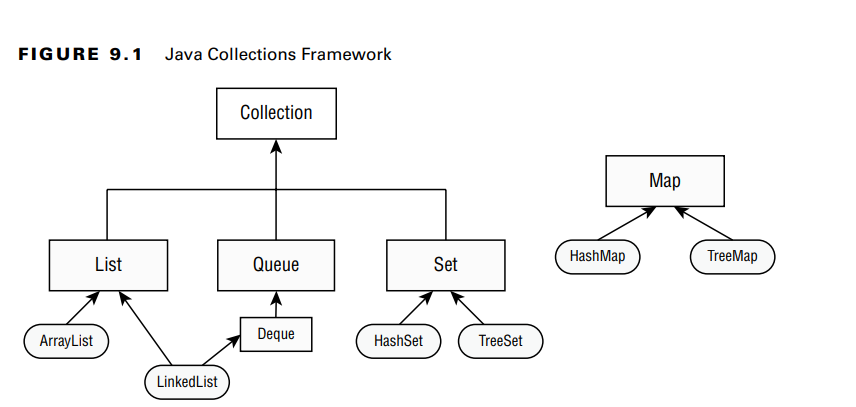
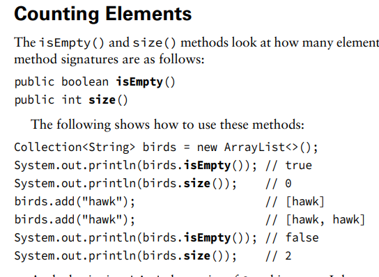
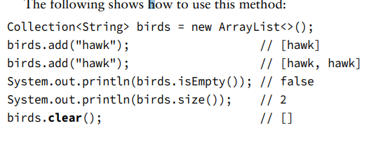
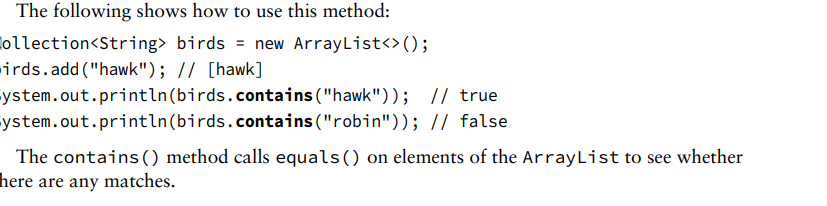
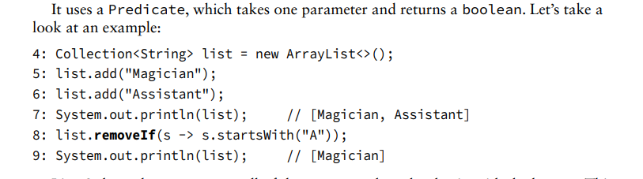

A collection is a group of objects contained in a single object. The Java Collections Framework is a set of classes in java.util for storing collections. There are four main interfaces
in the Java Collections Framework.
■ List: A list is an ordered collection of elements that allows duplicate entries. Elements
in a list can be accessed by an int index.
■ Set: A set is a collection that does not allow duplicate entries.
■ Queue: A queue is a collection that orders its elements in a specific order for processing.
A Deque is a subinterface of Queue that allows access at both ends.
■ Map: A map is a collection that maps keys to values, with no duplicate keys allowed. The
elements in a map are key/value pairs. The reason maps are
treated differently is that they need different methods due to being key/value pairs.

**Using the Diamond Operator**
When constructing a Java Collections Framework, you need to specify the type that will go
inside. We could write code using generics like the following:
List<Integer>list=new ArrayList<Integer>();

the diamond operator (<>) is a shorthand  notation that allows you to omit the generic type from
the right side of a statement when the type can be inferred. Omitting specifying the data type means you don't have to 
explicitly mention what type of data you're working with when creating an object.
_Example:_List<String> myList = new ArrayList<>(); // You don't need to specify <String> on the right side
Map<Long,List<Integer>> mapOfLists = new HashMap<>();
 
the diamond operator cannot be used as the type in a variable declaration. It can be  used only on the right side 
of an assignment operation.

**Adding Data**
The add() method inserts a new element into the Collection and returns whether it was successful. 
The method signature is as follows:
public boolean add(E element)

For some Collection types,  add() always returns true. For other types, there is logic as to whether the add() call was
successful. In other words the behavior can vary:

1- Always Returns True: For some collection types, like Lists in many programming languages, 
when you call add() to add an element, it always returns true. This essentially means that the element is 
added successfully every time, and there's no logic to check whether the addition was successful or not.

2-Conditional Return: In contrast, for other collection types, such as Sets, 
the add() function may return true if the element was added successfully and false if it wasn't. 

**Removing Data**
The remove() method removes a single matching value in the Collection and returns whether it
was successful. The method signature is as follows:
public boolean remove(Object object)

**Counting Elements**
The isEmpty() and size() methods look at how many elements are in the Collection. The
method signatures are as follows:
public boolean isEmpty()
public int size()
Example: 

**Clearing the Collection**
The clear() method provides an easy way to discard all elements of the Collection. The method
signature is as follows:
public void clear()****

**Check Content**
The contains() method checks whether a certain value is in the Collection. The method
signature is as follows:
public boolean contains(Object object) example: 

**Removing with Conditions**
The removeIf() method removes all elements that match a condition.
public boolean removeIf(Predicate<? super E> filter)It uses a Predicate, which takes one parameter and returns a boolean
example:

**Iterating**
There’s a forEach() method that you can call on a Collection instead of writing a loop. It uses a
Consumer that takes a single parameter and doesn’t return anything
public void forEach(Consumer<? super T> action)

**Determining Equality**
There is a custom implementation of equals() so you can compare two Collections to compare
the type and contents. The implementation will vary. For example, ArrayList checks order,  while HashSet does not.
boolean equals(Object object)

