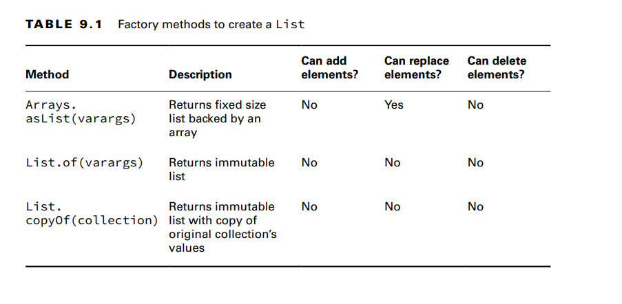
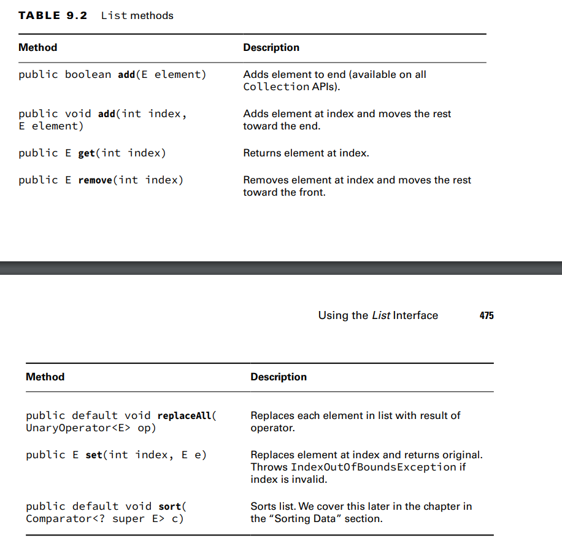

Comparing List Implementations
An ArrayList is like a resizable array. When elements are added, the ArrayList automatically
grows. When you aren’t sure which collection to use, use an ArrayList.
the main benefit of an ArrayList is that you can look up any element in constant time
A LinkedList is special because it implements both List and Deque. It has all the methods
of a List. It also has additional methods to facilitate adding or removing from the beginning
and/or end of the list. The main benefits of a LinkedList are that you can access, add to, and remove from the
beginning and end of the list in constant time.

a LinkedList a good choice when you’ll be using it as Deque

**Creating a List with a Factory** 
When you create a List of type ArrayList or LinkedList, you know the type. 

**Creating a List with a Constructor**
Most Collections have two constructors that you need to know for the exam. The following
shows them for LinkedList:
var linked1 = new LinkedList<String>(); --> The first says to create an empty LinkedList containing all the defaults.
var linked2 = new LinkedList<String>(linked1);->The second tells Java that we want to make a copy of another LinkedList.

-ArrayList has an extra constructor you need to know. We now show the three constructors:
var list1 = new ArrayList<String>();
var list2 = new ArrayList<String>(list1);
var list3 = new ArrayList<String>(10);

**-Working with List Methods** 
The methods in the List interface are for working with indexes.

**Converting from List to an Array**
