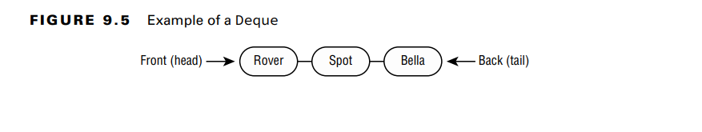
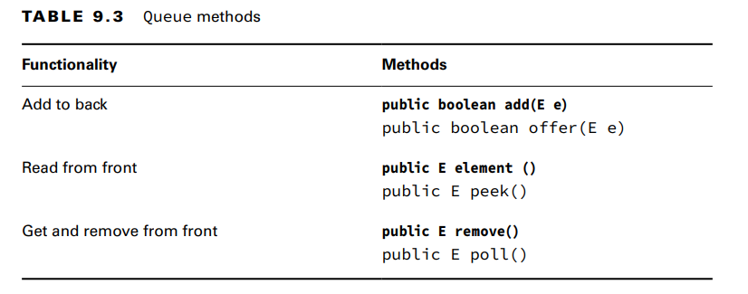
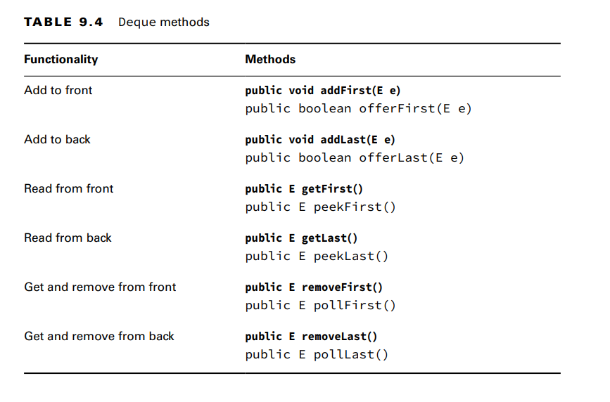
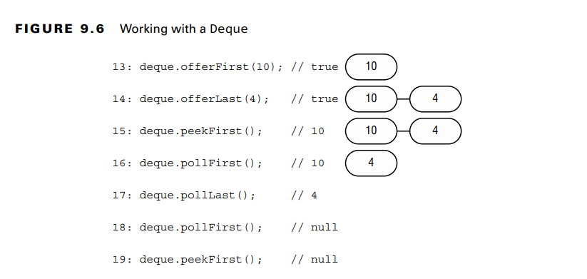
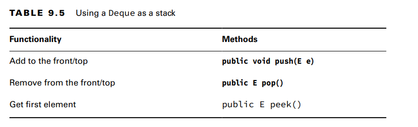

You use a Queue when elements are added and removed in a specific order. You can think of a queue as a line.
A Deque (double-ended queue), often pronounced “deck,” is different from a regular
queue in that you can insert and remove elements from both the front (head) and back (tail).

**Comparing Deque Implementations**

You saw LinkedList earlier in the List section. In addition to being a list, it is a Deque.
The main benefit of a LinkedList is that it implements both the List and Deque
interfaces. The trade-off is that it isn’t as efficient as a “pure” queue. You can use the
ArrayDeque class if you don’t need the List methods.

**Working with Queue and Deque Methods**:
Since the Deque interface supports doubleended queues, it inherits all Queue methods and adds more so that it is clear 
if we are  working with the front or back of the queue.  

In addition to FIFO queues, there are LIFO (last-in, first-out) queues, which are commonly referred to as stacks.
Picture a stack of plates. You always add to or remove from the top of the stack to avoid a mess

