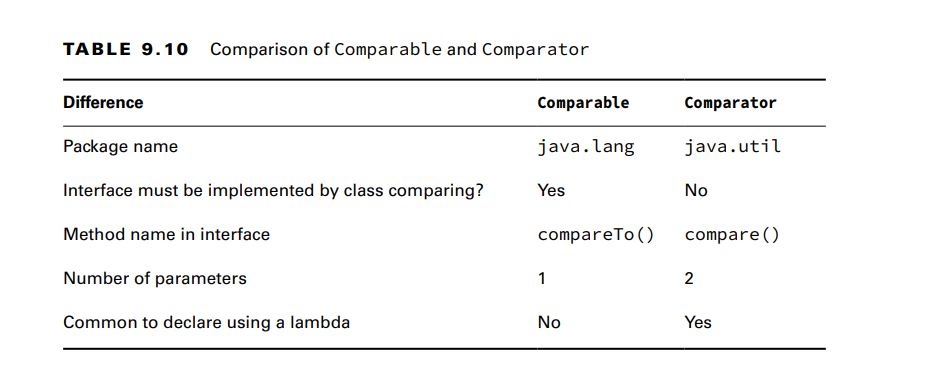
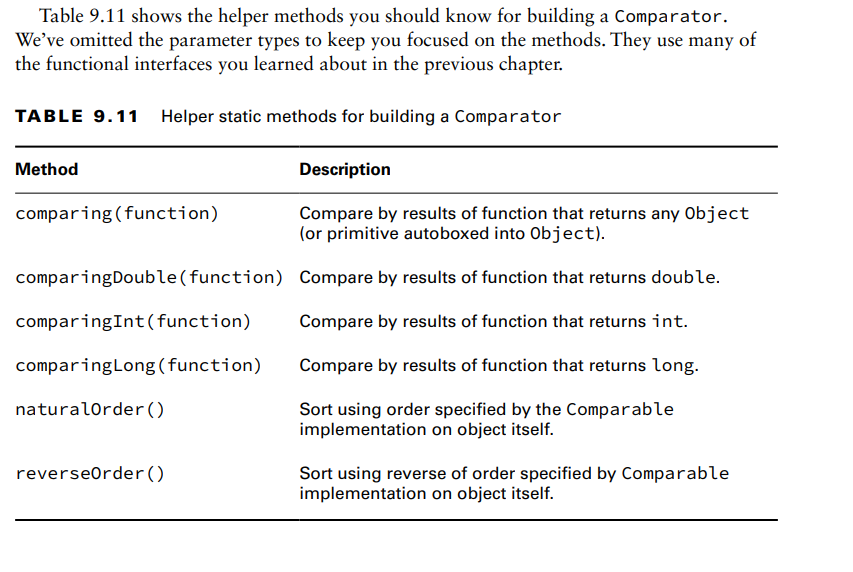
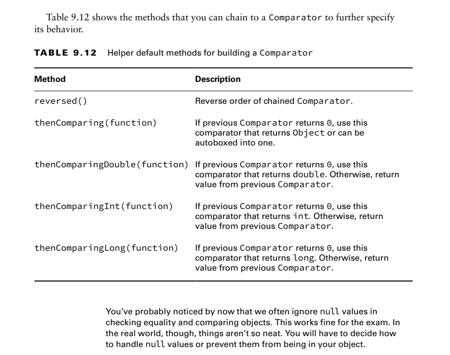

If your class implements Comparable, it can be used in data structures that
require comparison. There is also a class called Comparator, which is used to specify that
you want to use a different order than the object itself provides

**Creating a Comparable Class**
The Comparable interface has only one method. In fact, this is the entire interface:
public interface Comparable<T> {
int compareTo(T o);
}

still need to know what the compareTo() method returns so that we can write our own.
There are three rules to know:
■ The number 0 is returned when the current object is equivalent to the argument to
compareTo().
■ A negative number (less than 0) is returned when the current object is smaller than the
argument to compareTo().
■ A positive number (greater than 0) is returned when the current object is larger than the
argument to compareTo().

**Casting the compareTo() Argument**
When dealing with legacy code or code that does not use generics, the compareTo() method
requires a cast since it is passed an Object.
public class LegacyDuck implements Comparable {
private String name;
public int compareTo(Object obj) {
LegacyDuck d = (LegacyDuck) obj; // cast because no generics
return name.compareTo(d.name);
}
}
Since we don’t specify a generic type for Comparable, Java assumes that we want an
Object, which means that we have to cast to LegacyDuck before accessing instance variables on it.

Keeping compareTo() and equals() Consistent
The compareTo() method returns 0 if two objects are equal, while your equals()
method returns true if two objects are equal. A natural ordering that uses compareTo() is said
to be consistent with equals if, and only if, x.equals(y) is true whenever x.compareTo(y) equals 0.\
Similarly, x.equals(y) must be false whenever x.compareTo(y) is not 0. 

**Comparing Comparable and Comparator** 

Do you see why this doesn’t compile?
var byWeight = new Comparator<Duck>() { // DOES NOT COMPILE
public int compareTo(Duck d1, Duck d2) {
return d1.getWeight()-d2.getWeight();
}
};The method name is wrong. A Comparator must implement a method named compare()

**Comparing Multiple Fields**

**Sorting and Searching**

The Collections.sort() method uses the  compareTo() method to sort. It expects the objects to be sorted to be Comparable.

The sort() and binarySearch() methods allow you to pass in a Comparator object  when you don’t want to use 
he natural order.

**Sorting a List**

While you can call Collections.sort(list), you can also sort directly on the list object

The sort() method takes a Comparator that
provides the sort order. Remember that Comparator takes two parameters and returns an
int.
There is not a sort method on Set or Map. Both of those types are unordered, so it
wouldn’t make sense to sort them