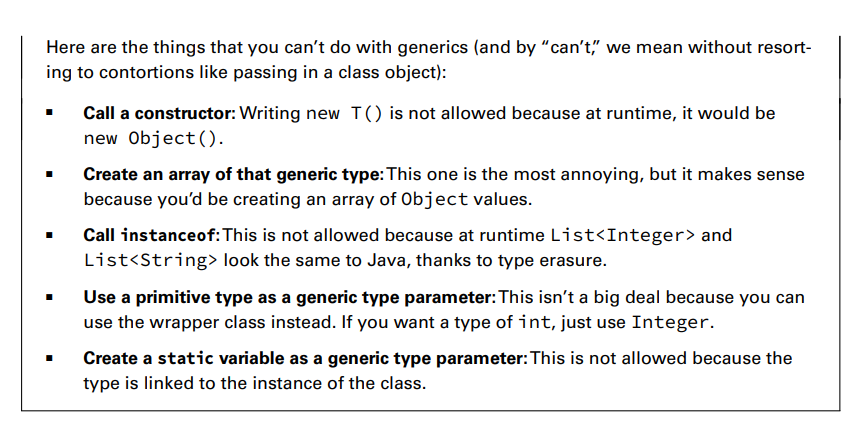
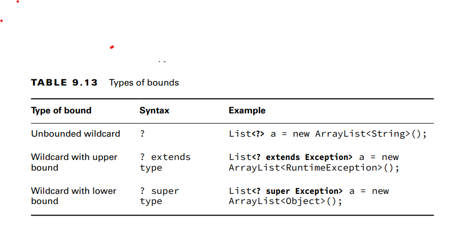
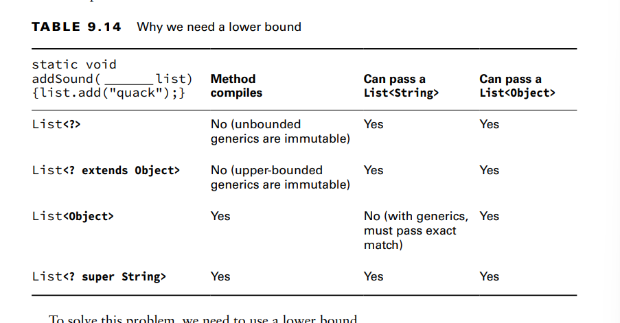

**Creating Generic Classes**

You can introduce generics into your own classes. The syntax for introducing a generic is to
declare a formal type parameter in angle brackets. For example, the following class named
Crate has a generic type variable declared after the name of the class:
public class Crate<T> {
private T contents;
public T lookInCrate() {
return contents;
}
public void packCrate(T contents) {
this.contents = contents;
}
}
The generic type T is available anywhere within the Crate class. When you instantiate the
class, you tell the compiler what T should be for that particular instance.

Generic classes become useful when the classes used as the type parameter can have absolutely nothing to do with 
each other

**Understanding Type Erasure:**

Type erasure allows your code to be compatible with older versions of Java that do not contain generics

**Overloading a Generic Method:**

Only one of these two methods is allowed in a class because type erasure will reduce both
sets of arguments to (List input):
public class LongTailAnimal {
protected void chew(List<Object> input) {}
protected void chew(List<Double> input) {} // DOES NOT COMPILE
}
in other words, this men creating several versions of a method that can handle different types of data while
using the same method name.
Example:
public class Calculator {
public int add(int a, int b) {
return a + b;
}
    public double add(double a, double b) {
        return a + b;
    }
}
public class Main {
public static void main(String[] args) {
Calculator calculator = new Calculator();
        int sum1 = calculator.add(5, 3);          // Calls the int version
        double sum2 = calculator.add(2.5, 3.7);    // Calls the double version
        
        System.out.println("Sum 1: " + sum1);
        System.out.println("Sum 2: " + sum2);
    }
}

**Returning Generic Types**

the return values must  be covariant. In terms of generics, this means that the return type of the class or interface
declared in the overriding method must be a subtype of the class defined in the parent class.
The generic parameter type must match its parent’s type exactly

Review: , a covariant relationship between data types means that if you have a parent data type and 
a child data type (subtype), the child data type can be used in the same way as the parent data type,
and their relationship goes in the same direction.
For example, if you have a parent class Animal and a child class Dog (which is a subtype of Animal),
and you can use a Dog wherever you expect an Animal, this is a covariant relationship. 
It means you can substitute the child type (Dog) for the parent type (Animal) without any issues

**remember, generic methods cannot be overloaded by changing the generic parameter type only.**

**Implementing Generic Interfaces**:
There are three ways a class can approach implementing this interface. The first is to
specify the generic type in the class
-The next way is to create a generic class
-The final way is to not use generics at all. 

**Writing Generic Methods**
The method parameter is the generic type T. Before the return type, we declare the formal
type parameter of <T>. In the ship() method, we show how you can use the generic parameter in the return type, 
Crate<T>, for the method. Unless a method is obtaining the generic formal type parameter from the class/interface,
it is specified immediately before the return type of the method.

**Bounding Generic Types**
A bounded parameter type is a generic type that specifies a bound for the generic.
A wildcard generic type is an unknown generic type represented with a question mark (?).

you can use generic wildcards in 3 ways:

**Creating Unbounded Wildcards**
An unbounded wildcard represents any data type. You use ? when you want to specify that
any type is okay with you

**Creating Upper-Bounded Wildcards:**
Upper bounds are  like anonymous classes in that they use extends regardless of whether we are working with
a class or an interface.

example: private void anyFlyer(List<Flyer> flyer) {}
private void groupOfFlyers(List<? extends Flyer> flyer) {}

**Creating Lower-Bounded Wildcards** 

Putting It All Together

**some practice:**
6: List<?> list1 = new ArrayList<A>(); this works. because
ou are declaring a List called list1, and you're using <?> as the type parameter. The <?> is a wildcard that means
"any type" or "unknown type."The right side new ArrayList<A>() creates an ArrayList that holds elements of type A
since you're using the wildcard on the left side (List<?>), it's allowed to hold any type of object, 
so it's safe to assign an ArrayList<A>

7: List<? extends A> list2 = new ArrayList<A>(); it compiles because
This line declares a List called list2, and it uses a wildcard with extends. When you use <? extends A>,
you're saying that list2 can hold a list of objects that are of type A or any subtype of A.
ArrayList<A> is an ArrayList of type A, which is compatible with List<? extends A> because it's of the same type (A) 
or a subtype of A

8: List<? super A> list3 = new ArrayList<A>();
this line declares a List called list3, and it uses a wildcard with super. When you use <? super A>, 
you're saying that list3 can hold a list of objects that are of type A or any superclass of A
ArrayList<A> is an ArrayList of type A, and A is also its superclass. So, it's compatible with List<? super A> 
because it can hold objects of type A or any superclass of A.

9: List<? extends B> list4 = new ArrayList<A>(); // DOES NOT COMPILE
Breakdown: List<? extends B> means that list4 can hold a list of objects that are of type B or any subtype of B
on the right we are trying to assign an Array list of type A to list 4.
In this case, A is not a subtype of B, which means that this assignment would violate the wildcard's upper bound 
constraint.

10: List<? super B> list5 = new ArrayList<A>();

11: List<?> list6 = new ArrayList<? extends A>(); // DOES NOT COMPILE
In this case, the assignment is not valid because the unbounded wildcard (?) does not match the upper-bounded wildcard 
(? extends A). 

Summary
The Java Collections Framework includes four main types of data structures: lists, sets,
queues, and maps. The Collection interface is the parent interface of List, Set, and Queue.
Additionally, Deque extends Queue. The Map interface does not extend Collection. You need
to recognize the following:
■ List: An ordered collection of elements that allows duplicate entries
■ ArrayList: Standard resizable list
■ LinkedList: Can easily add/remove from beginning or end
■ Set: Does not allow duplicates
■ HashSet: Uses hashCode() to find unordered elements.
■ TreeSet: Sorted. Does not allow null values.
■ Queue/Deque: Orders elements for processing
■ ArrayDeque: Double-ended queue
■ LinkedList: Double-ended queue and list
■ Map: Maps unique keys to values
■ HashMap: Uses hashCode() to find keys.
■ TreeMap: Sorted map. Does not allow null keys. 

-The Comparable interface declares the compareTo() method. This method returns a
negative number if the object is smaller than its argument, 0 if the two objects are equal, and
a positive number otherwise.The compareTo() method is declared on the object that is
being compared, and it takes one parameter.

-The Comparator interface defines the compare()method. A negative number is returned if the first argument is smaller,
zero if they are equal, and a positive number otherwise. The compare() method can be declared in any code, and
it takes two parameters. A Comparator is often implemented using a lambda.

-Generics are type parameters for code. To create a class with a generic parameter, add
<T> after the class name. Generics allow you to specify wildcards

- <?> is an unbounded wildcard that means any type.
- <? extends Object> is an upper bound that means any type that is Object or extends it.
- <? extends MyInterface> means any type that implements MyInterface. 
- <? super Number> is a lower bound that means any type that is Number or a superclass. 
- A compiler error results from code that attempts to add an
item in a list with an unbounded or upper-bounded wildcard.

