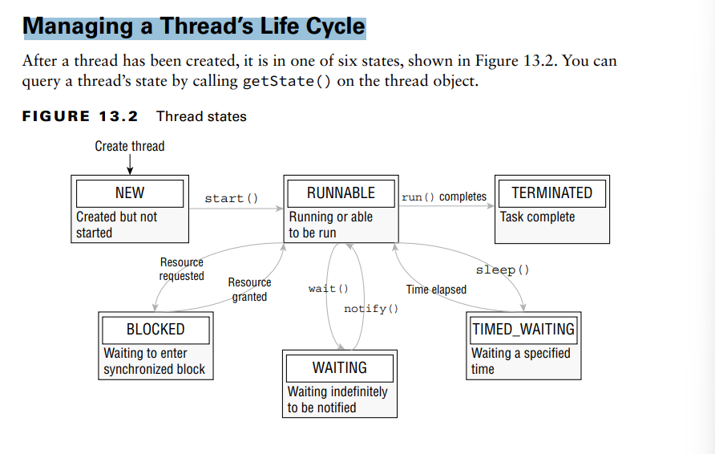

multithreaded processing. The idea behind multithreaded processing is to allow an application or group of applications to
execute multiple tasks at the same time.

**Introducing Threads**
- A thread is the smallest unit of execution that can be scheduled by the operating system
- A process is a group of associated threads that execute in the same shared environment.
-  a single-threaded process is one that contains exactly one thread, whereas a multithreaded process supports 
more than one thread.
- By shared environment, we mean that the threads in the same process share the same
memory space and can communicate directly with one another

In other Words: Threads allows a program to operate more efficiently by doing multiple things at the same time.
Threads can be used to perform complicated tasks in the background without interrupting the main program
**Understanding Thread Concurrency**
- The property of executing multiple threads and processes at the same time is referred to
  as concurrency.
- Operating systems use a thread scheduler to determine which threads
  should be currently executing, 
- A context switch is the process of storing a thread’s current state and
  later restoring the state of the thread to continue execution
- A thread priority is a numeric value associated with a thread that
  is taken into consideration by the thread scheduler when determining which threads should
  currently be executing

**Creating a Thread**
One of the most common ways to define a task for a thread is by using the Runnable instance. 
Runnable is a functional interface that takes no arguments and returns no data.
@FunctionalInterface public interface Runnable {
void run();
}
with it you can create and start a Thread:
new Thread(() -> System.out.print("Hello")).start();
System.out.print("World");

More generally, we can create a Thread and its associated task one of two ways in Java:
■ Provide a Runnable object or lambda expression to the Thread constructor.
■ Create a class that extends Thread and overrides the run() method.

**Distinguishing Thread Types**
What if we change job to be a daemon thread by adding this to line 11?
11: job.setDaemon(true);
The program will print the first statement and terminate without ever printing the
second line.
Main method finished
For the exam, just remember that by default, user-defined threads are not daemons, and
the program will wait for them to finish

**Managing a Thread’s Life CycleS**
**Polling with Sleep** 

# **Summary:**

## 1 -Creating a Thread
There are two ways to create a thread.
It can be created by extending the Thread class and overriding its run() method:
public class Main extends Thread {
public void run() {
System.out.println("This code is running in a thread");
}
}

-Another way to create a thread is to implement the Runnable interface:
public class Main implements Runnable {
public void run() {
System.out.println("This code is running in a thread");
}
}

## 2- Running Threads
If the class extends the Thread class, the thread can be run by creating an instance of the class and 
call its start() method:

public class Main extends Thread {
public static void main(String[] args) {
Main thread = new Main();
thread.start();
System.out.println("This code is outside of the thread");
}
public void run() {
System.out.println("This code is running in a thread");
}
}

- If the class implements the Runnable interface, the thread can be run by passing an instance of the class to a Thread
object's constructor and then calling the thread's start() method:
- public class Main implements Runnable {
  public static void main(String[] args) {
  Main obj = new Main();
  Thread thread = new Thread(obj);
  thread.start();
  System.out.println("This code is outside of the thread");
  }
  public void run() {
  System.out.println("This code is running in a thread");
  }
  }