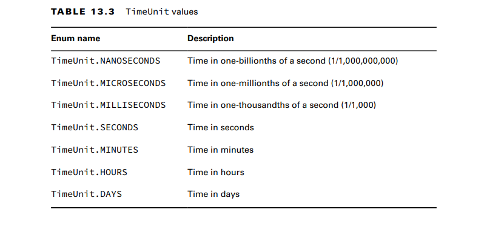

Java includes the java.util.concurrent package, which we refer to as the Concurrency API, to handle the complicated work
of managing threads for you.

**Shutting Down a Thread Executor**
Once you have finished using a thread executor, it is important that you call the shutdown()
method.
For the exam, you should be aware that shutdown() does not stop any tasks that have
already been submitted to the thread executor
The ExecutorService
provides a method called shutdownNow(), which attempts to stop all running tasks and
discards any that have not been started yet. 

**Submitting Tasks**
The execute() method takes a Runnable instance and completes the task asynchronously
submit() methods to the ExecutorService
interface, which, like execute(), can be used to complete tasks asynchronously. Unlike
execute(), though, submit() returns a Future instance that can be used to determine
whether the task is complete

**Waiting for Results**

n, the submit() method returns a Future<V> instance that can
be used to determine this result.
Future<?> future = service.submit(() -> System.out.println("Hello"));

As Future<V> is a generic interface, the type V
is determined by the return type of the Runnable method. Since the return type of
Runnable.run() is void, the get() method always returns null when working with
Runnable expressions.
The Future.get() method can take an optional value and enum type
java.util.concurrent.TimeUnit

Introducing Callable
